<p align="center">
  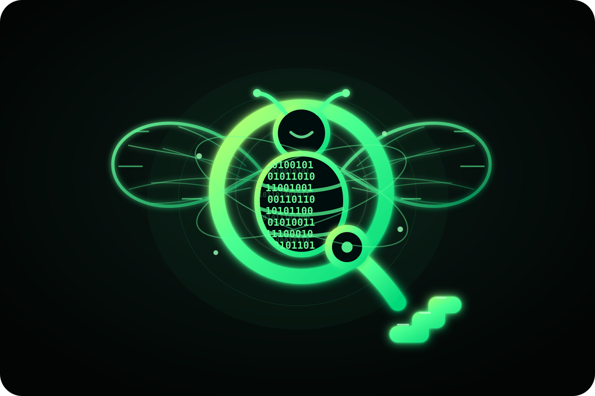
</p>

<h1 align="center">Qubee</h1>

<p align="center">
  <strong>Post-quantum, peer-to-peer secure messaging for Android.</strong><br />
  A Kotlin/Compose client backed by a Rust cryptographic and networking core.
</p>

<p align="center">
  <a href="https://github.com/MKlolbullen/Qubee/actions/workflows/ci.yml"></a>
  <a href="https://github.com/MKlolbullen/Qubee/actions/workflows/android-smoke.yml"></a>
  <a href="https://github.com/MKlolbullen/Qubee/actions/workflows/instrumented-tests.yml"></a>
  <a href="https://github.com/MKlolbullen/Qubee/actions/workflows/jni-contracts.yml"></a>
  <a href="https://github.com/MKlolbullen/Qubee/releases"></a>
</p>

<p align="center">
  
  
  
  
  <a href="LICENSE"></a>
</p>

<p align="center">
  <a href="#overview">Overview</a> ·
  <a href="#architecture">Architecture</a> ·
  <a href="#security-model">Security</a> ·
  <a href="#build-from-source">Build</a> ·
  <a href="#testing">Testing</a> ·
  <a href="#roadmap">Roadmap</a>
</p>

---

> [!WARNING]
> **Qubee is pre-alpha research software.** It has not received an independent security audit. Do not use it for safety-of-life communications, high-risk operational traffic, or anything where compromise would be catastrophic. The Rust core is heavily tested, but the Android application and end-to-end product flow are still under active development. Treat the live CI badges—not optimistic prose—as the source of truth for build health.

## Overview

Qubee is an experimental secure messenger built around three ideas:

1. **Cryptographic authority belongs in a memory-safe core.** Identity, key management, protocol state, encryption, signatures, and peer-to-peer networking live in Rust. Kotlin owns Android lifecycle, presentation, persistence orchestration, and user interaction.
2. **Post-quantum protection should be hybrid, not theatrical.** Qubee combines classical primitives with NIST-standardized post-quantum primitives rather than pretending a single new algorithm magically fixes every layer.
3. **No central message server.** Peers communicate over libp2p using direct transports and gossip-based group distribution. That removes a central message custodian, but it does **not** remove network metadata or IP exposure.

The project currently focuses on Android, small trusted groups, QR/deep-link onboarding, out-of-band contact verification, encrypted local storage, and a staged migration toward forward-secret and deniable messaging.

### A look at the app

<p align="center">
  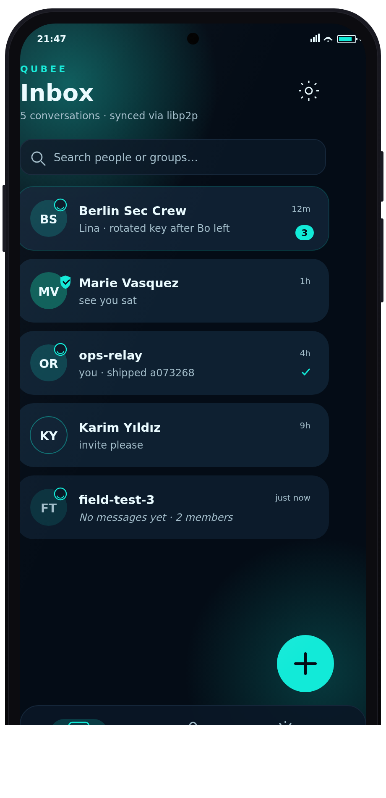
  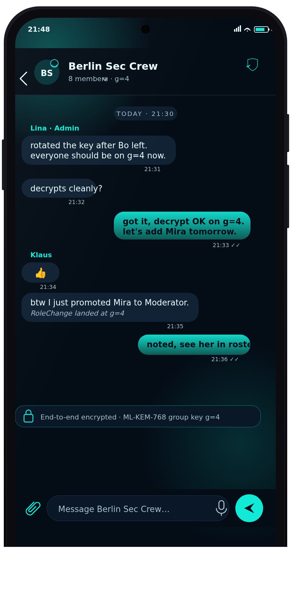
  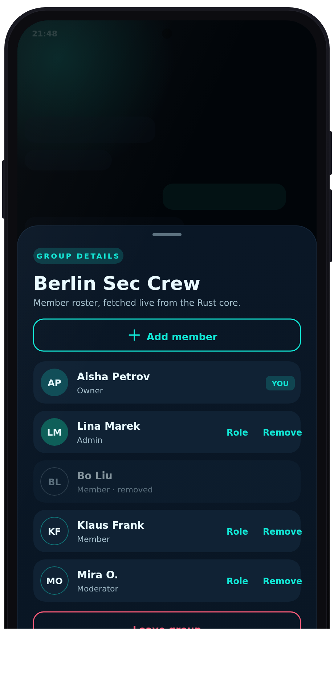
  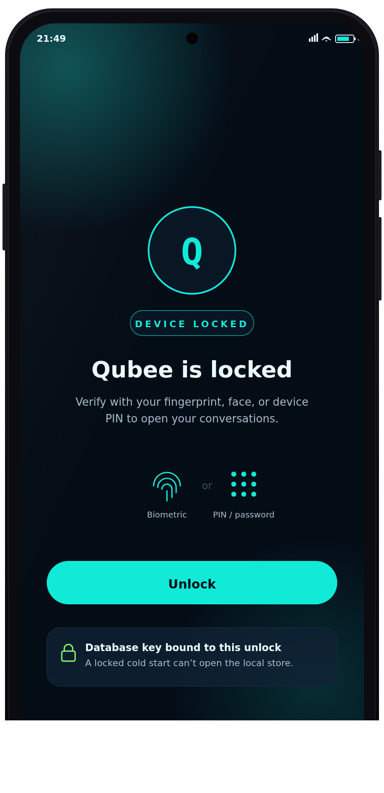
</p>
<p align="center">
  <em>Inbox · Group chat · Group details · Screen lock —
  design mockups; the committed Paparazzi baselines are the source of truth for shipped UI.</em>
</p>

### What Qubee is—and is not

| Qubee is | Qubee is not |
|---|---|
| A research-grade Android messenger with a Rust security core | A finished Signal replacement |
| Hybrid classical + post-quantum cryptography | “Quantum encryption” marketing fog |
| Direct peer-to-peer communication over libp2p | Anonymous routing or a mixnet |
| Explicit identity verification using fingerprints, SAS, and QR | Automatic proof that a human is trustworthy |
| Encrypted local persistence with hardware-backed key wrapping | Protection from a fully compromised, unlocked device |
| A security engineering project with tests and pinned wire formats | Independently audited production software |

## At a glance

| Layer | Implementation |
|---|---|
| **Android client** | Kotlin, Jetpack Compose, Material 3, MVVM, Hilt, Coroutines/Flow |
| **Native core** | Rust crate `qubee_crypto`, exposed through JNI as Android `.so` libraries |
| **Identity signatures** | Hybrid Ed25519 + ML-DSA-44; both components must verify |
| **Post-quantum key establishment** | ML-KEM-768 |
| **Classical key agreement** | X25519 where used by the ratchet/prekey design |
| **Payload encryption** | ChaCha20-Poly1305 |
| **Hashing and derivation** | BLAKE3, HKDF, SHA-2, Argon2id for keystore wrapping |
| **P2P networking** | libp2p over TCP, WebSocket, and QUIC; Noise XX/TLS, Yamux, anonymous gossipsub, Kademlia, DNS (mDNS present but off by default so a device doesn't broadcast its LAN presence) |
| **Android database** | Room over SQLCipher; per-install database key wrapped by Android Keystore |
| **Rust key storage** | Encrypted keystore with authenticated entries, atomic writes, crash-safe master-key rotation, zeroization |
| **Group model** | Maximum 16 members; Owner, Admin, Moderator, Member, Observer roles |
| **Supported Android** | `minSdk 24`, `targetSdk 34`, four ABIs |
| **License** | MIT |

## Feature status

The distinction between **implemented**, **enabled**, and **planned** matters. Security projects get dangerous when those words are blurred.

| Capability | Status | Notes |
|---|---:|---|
| Hybrid identity generation and signed onboarding bundles | ✅ Active | Ed25519 + ML-DSA-44 identity material is created and persisted by the Rust core. |
| Identity sharing through QR/deep links | ✅ Active | `qubee://identity/...` onboarding flow. |
| Fingerprint, SAS, and QR contact verification | ✅ Active | Verification state is persisted; key changes can be surfaced separately from verified trust. |
| Direct libp2p networking | ✅ Active | TCP/WebSocket + Noise and QUIC are configured; the persistent libp2p key keeps `PeerId` stable across restarts. |
| Encrypted 1:1 and group message envelopes | ✅ Active | Current default send path uses the established signed-envelope format. |
| Group creation, invites, membership, roles, and state sync | ✅ Active | CSPRNG invitation codes, atomic use accounting, signed membership broadcasts, and offline snapshot resync. |
| SQLCipher-backed Android storage | ✅ Active | Messages, contacts, and conversations are stored in encrypted Room tables under a hardware-Keystore-wrapped random key. |
| App screen lock (biometric / device credential) | ✅ Active | Opt-in (Settings → Screen lock, default off). Biometric or PIN/pattern/password gate on cold start and foreground return, with `FLAG_SECURE`. |
| Unlock-bound database key | 🟡 Wired, device-validation pending | When Screen Lock is on, the SQLCipher key + Rust-core passphrase are re-wrapped under an auth-bound Keystore key (per-use `CryptoObject`); a cold process can't open the datastore until unlocked. Builds green; needs real-hardware validation across API levels before relying on it. |
| Delivery acknowledgements | 🟡 Partial | The protocol includes signed acknowledgements; UI semantics and end-to-end device validation remain pre-alpha. |
| PQXDH + Double Ratchet for 1:1 messaging | 🟡 Dark-launched | Send and receive paths are both fully wired (prekey publication, fail-closed send, session persistence); emission is gated behind a rollout preference that is off by default pending two-device validation. |
| Sender keys for groups | 🟡 Dark-launched | Wire format, receive path, and the flag-gated send path (sender-key distribution fan-out, post-rekey redistribution) are wired; default send traffic has not cut over pending two-device validation. |
| Reproducible signed releases | 🟡 Infrastructure present | Release workflow and reproducibility guidance exist; verify the actual tag, checksum, and CI result before installing. |
| Voice/video calling | ❌ Not shipped | WebRTC code is feature-gated behind `calling` and not part of the default build. |
| File-transfer protocol | ❌ Not shipped | Legacy code is feature-gated and not production-ready. |
| Tor, onion routing, relay privacy, or mixnet transport | ❌ Not shipped | Direct peers can learn each other’s IP addresses. |
| Multi-device identity synchronization | ❌ Not shipped | Current identity model is device-local. |

## Architecture

Qubee deliberately keeps Kotlin away from raw private-key operations. The Android layer requests operations; the Rust core performs them and returns bounded results or callbacks.

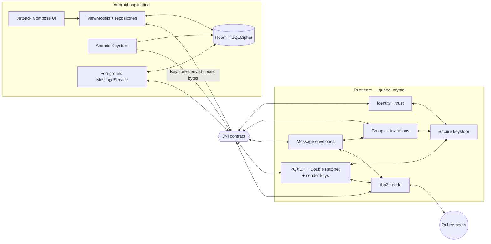

### Responsibility boundary

| Android owns | Rust owns |
|---|---|
| Screens, navigation, permissions, lifecycle | Identity key generation and verification |
| ViewModels, repositories, UI state | Hybrid signatures and canonical signed bytes |
| Room entities and SQLCipher database integration | ML-KEM encapsulation/decapsulation |
| Foreground service and notification plumbing | Group key rotation and membership state |
| QR scanner and share intents | Ratchet/session state and replay handling |
| Android Keystore key wrapping | Encrypted Rust keystore and secure memory handling |
| User-facing trust ceremonies | libp2p transport and authenticated peer events |

## Protocol flows

### Identity onboarding and verification

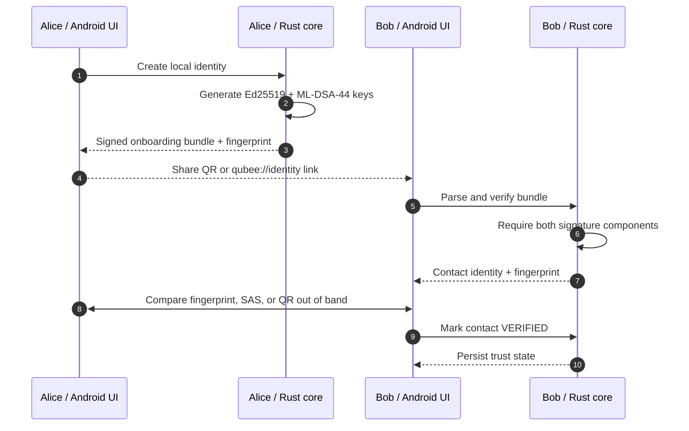

The QR code is a transport mechanism, not a trust oracle. Verification only becomes meaningful when the users compare the fingerprint or SAS over a channel an attacker cannot silently replace.

### Group join and key rotation

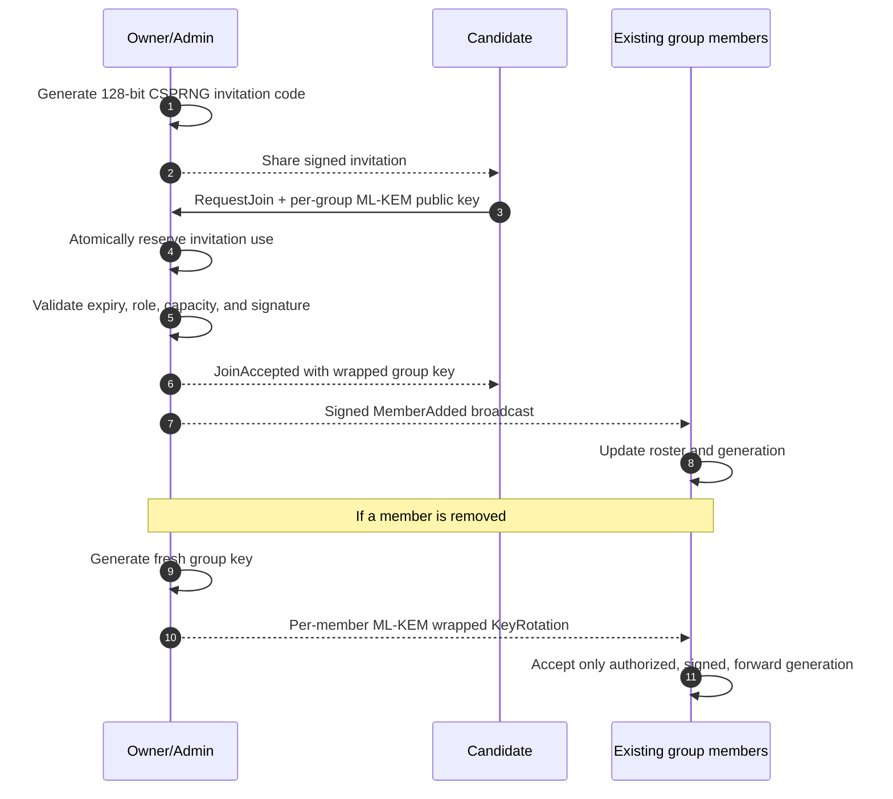

### Message path

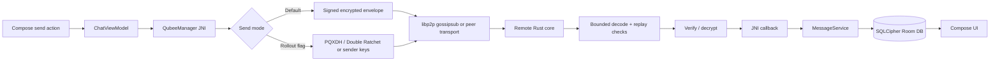

## Security model

Qubee uses layered protection. No single primitive is treated as holy water.

### 1. Identity authenticity

Long-term identity operations use a hybrid signature:

- **Ed25519** provides mature classical authentication.
- **ML-DSA-44** provides post-quantum signature resistance.
- Verification requires **both** components to pass.
- Canonical signed payloads use explicit domain-separation tags and length-bounded encodings.

Hybrid signatures protect against a failure in either the classical or post-quantum assumption, provided the other remains secure and the composition is correct.

### 2. Post-quantum key encapsulation

ML-KEM-768 is used to wrap sensitive key material for intended recipients, including group key distribution and rotation. Each group member carries a per-group KEM public key so membership changes can trigger recipient-specific rekeying.

### 3. Transport protection

libp2p establishes authenticated encrypted transport using:

- Noise XX over TCP/WebSocket transports.
- QUIC with TLS 1.3 as an additional direct transport.
- Yamux stream multiplexing.
- **Anonymous** gossipsub authorship: group frames are authenticated at the application layer (hybrid identity / sender-key signatures), so the transport no longer broadcasts an author `PeerId` to every topic subscriber. The `PeerId`↔identity linkage is learned only from authenticated in-band membership frames or the direct request/response channel, never from the gossip author.

Transport encryption prevents passive observers from reading payloads in flight. Application-layer encryption remains necessary because group gossip and stored envelopes have a different trust boundary.

### 4. Message-layer protection

The default message path uses ChaCha20-Poly1305 under group/session key material plus hybrid identity signatures and strict generation checks.

The newer ratchet path adds:

- PQXDH-style prekey establishment.
- Persistent Double Ratchet state for 1:1 sessions.
- Replay rejection and bounded skipped-key handling.
- Group sender chains with per-sender forward evolution.
- Deniable message authentication inside the ratcheted formats.

That path is intentionally staged. Receiving new formats before emitting them avoids a flag-day protocol break. The send rollout remains gated until multi-device validation is complete.

### 5. Local storage protection

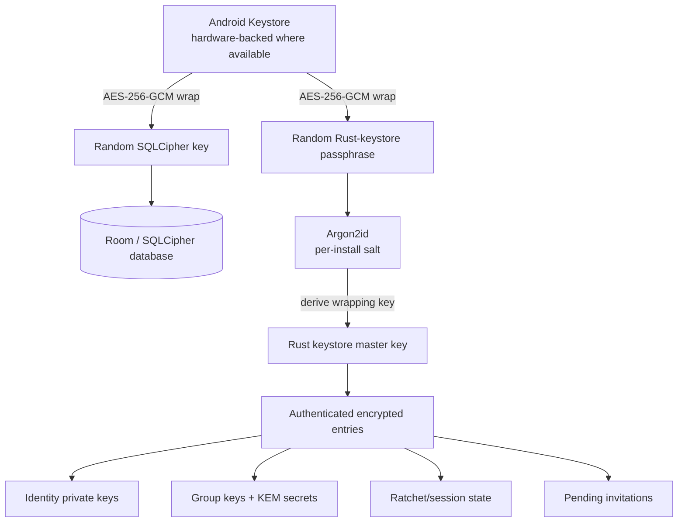

The Rust keystore additionally uses:

- ChaCha20-Poly1305 authenticated encryption.
- Entry-specific associated data to prevent ciphertext swapping between key slots.
- Atomic temp-file, `fsync`, rename, and directory-sync writes.
- Crash-recoverable master-key rotation.
- `SecretBox`, `Zeroize`, and explicit buffer scrubbing.
- `mlock`/`munlock` on supported Unix systems.

### Security properties and limitations

| Property | Current position |
|---|---|
| Payload confidentiality on the network | Yes, using transport and application encryption |
| Sender and control-frame authentication | Yes, with hybrid signatures on the active signed formats |
| Post-quantum KEM/signature primitives | Yes, ML-KEM-768 and ML-DSA-44 |
| Local database encryption | Yes, SQLCipher with a Keystore-wrapped random key; optionally re-wrapped under an unlock-bound key when Screen Lock is on |
| Rust key-store encryption | Yes, authenticated encryption and Keystore-derived wrapping secret |
| At-rest protection on a locked/stolen device | Partial; with Screen Lock on, a cold process can’t open the datastore without a biometric/PIN unlock (device-validation pending) |
| Group rekey after member removal | Implemented |
| Offline group state recovery | Implemented through signed snapshot resync |
| Forward secrecy on the default send path | Not fully; ratchet rollout is still gated |
| Post-compromise security | Not guaranteed on the default path |
| Deniability | Ratcheted formats are designed for it; the active signed legacy envelope is non-repudiable |
| Group authorship metadata on the network | Not broadcast; gossip authorship is anonymous, so a topic subscriber can see that a group has traffic but not which `PeerId` authored a given message |
| IP-address privacy | No; direct peers can observe each other’s network addresses (Tor/onion transport is a planned opt-in, not shipped) |
| Traffic-analysis resistance | Partial and narrow; fixed-size length-padding buckets are applied on the forward-secret ratchet paths, but there is no onion routing, mixnet, or cover-traffic system |
| Protection after full device compromise | No |
| Independent audit | No |

For reporting vulnerabilities, supported scope, acknowledged limitations, and safe-harbour terms, read [`SECURITY.md`](SECURITY.md).

## Trust states

Qubee separates cryptographic validity from human trust.

| State | Meaning |
|---|---|
| **Unknown / unverified** | The identity bundle is cryptographically valid, but the user has not compared it out of band. |
| **Verified** | The user completed a fingerprint, SAS, or QR comparison and persisted that decision. |
| **Key changed** | Previously observed identity material changed and must not silently inherit prior trust. |
| **Compromised / blocked** | The local policy refuses normal trust progression and prevents casual re-verification from clearing the warning. |

The 8-byte BLAKE3 fingerprint is derived from the combined classical and post-quantum public identity material. It is a human comparison aid, not a replacement for the full public keys.

## Groups and permissions

Qubee groups are intentionally small: **16 members maximum**.

| Role | Typical authority |
|---|---|
| **Owner** | Full group authority, ownership transfer, role and membership control |
| **Admin** | Administrative membership and rotation operations within policy |
| **Moderator** | Moderation-oriented permissions without ownership authority |
| **Member** | Normal encrypted messaging participation |
| **Observer** | Restricted participation/read-oriented role where configured |

Membership mutations are signed and versioned. Receivers reject stale or unexpected generations rather than trying to guess their way back into sync. Devices that were offline can request a signed state snapshot; only authorized responders may provide ownership-sensitive state.

## Visual system

Qubee’s visual language mirrors the security model: local ownership, post-quantum engineering, and direct peer trust—without turning every screen into a glowing hacker-movie aquarium.

| Token | Value | Use |
|---|---|---|
| **Void** | `#040C16` | Primary background |
| **Panel** | `#0A1726` | Cards and secure surfaces |
| **Cyan** | `#12EAD8` | Primary actions and live security state |
| **Blue** | `#00A7FF` | Gradient support and network state |
| **Green** | `#8CFF72` | Verified/post-quantum accent |
| **Text** | `#EAFBFF` | Primary text |
| **Muted** | `#A3BDCA` | Secondary explanation |
| **Danger** | `#FF5C7A` | Identity reset and destructive key actions |

The reusable Compose foundation lives in:

```text
app/src/main/java/com/qubee/messenger/ui/theme/QubeeDesign.kt
```

Design documentation and asset sources:

- [`docs/design-system.md`](docs/design-system.md)
- [`docs/branding/qubee_mark_master.svg`](docs/branding/qubee_mark_master.svg)
- [`docs/screenshot-tests.md`](docs/screenshot-tests.md)

Paparazzi snapshots are preferred over hand-drawn mockups for shipped UI because they render the real Composables and fail on visual drift. The mockups below illustrate intended layout and flow; the committed Paparazzi baselines under `app/src/test/snapshots/` are the source of truth for what actually renders.

### Mockups

Rendered PNGs are shown for reliable display; the editable sources live alongside them as `.svg`.

| | | |
|---|---|---|
| [](docs/mockups/01-inbox.svg)<br/>**Inbox** | [](docs/mockups/02-group-chat.svg)<br/>**Group chat** | [](docs/mockups/03-group-details.svg)<br/>**Group details** |
| [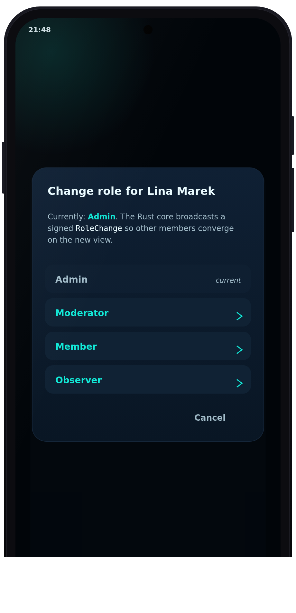](docs/mockups/04-role-picker.svg)<br/>**Role picker** | [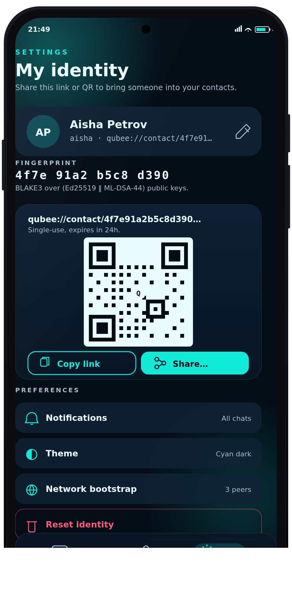](docs/mockups/05-settings-identity.svg)<br/>**Settings — identity** | [](docs/mockups/06-screen-lock.svg)<br/>**Screen lock** |

## Install

### Prebuilt APKs

Tagged builds may publish APKs and checksums through GitHub Releases:

1. Open the [Releases](https://github.com/MKlolbullen/Qubee/releases) page.
2. Select the intended pre-release tag.
3. Check that the release workflow completed successfully for that tag.
4. Download the APK and matching SHA-256 file.
5. Verify the checksum before installing.
6. Verify the signing identity described by the release/security documentation.

```bash
sha256sum -c qubee-<version>.apk.sha256
adb install qubee-<version>.apk
```

Do not install an APK whose checksum, signing identity, tag, or workflow provenance does not match.

## Build from source

### Prerequisites

- Git
- JDK 17
- Android Studio with Android SDK 34
- Android NDK **r26b** (`26.1.10909125`)
- Rust **1.88** as pinned by `rust-toolchain.toml`
- `cargo-ndk` 3.x
- Linux, macOS, Windows/PowerShell, or WSL for development

### 1. Clone

```bash
git clone https://github.com/MKlolbullen/Qubee.git
cd Qubee
```

### 2. Install the pinned Rust toolchain and Android targets

```bash
rustup show
rustup target add \
  aarch64-linux-android \
  armv7-linux-androideabi \
  x86_64-linux-android \
  i686-linux-android

cargo install cargo-ndk --locked --version '^3'
```

### 3. Point the build at the Android SDK/NDK

```bash
export ANDROID_HOME="$HOME/Android/Sdk"
export ANDROID_NDK_HOME="$ANDROID_HOME/ndk/26.1.10909125"
export NDK_HOME="$ANDROID_NDK_HOME"
printf 'sdk.dir=%s\n' "$ANDROID_HOME" > local.properties
```

### 4. Build the Rust shared libraries

Linux/macOS/WSL:

```bash
chmod +x build_rust.sh
./build_rust.sh
```

Windows PowerShell:

```powershell
./build_rust.ps1
```

The scripts build and copy libraries for:

```text
arm64-v8a
armeabi-v7a
x86
x86_64
```

Output lands under `app/src/main/jniLibs/`.

### 5. Build the Android application

```bash
chmod +x gradlew
./gradlew :app:assembleDebug --no-daemon --stacktrace
```

The debug APK is normally written to:

```text
app/build/outputs/apk/debug/app-debug.apk
```

Install it with:

```bash
adb install -r app/build/outputs/apk/debug/app-debug.apk
```

### Release build

A local unsigned release build can exercise R8/ProGuard without release secrets:

```bash
./gradlew :app:assembleRelease --no-daemon --stacktrace
```

Signed releases require the environment variables documented by [`RELEASE.md`](RELEASE.md):

```text
RELEASE_KEYSTORE_FILE
RELEASE_KEYSTORE_PASSWORD
RELEASE_KEY_ALIAS
RELEASE_KEY_PASSWORD
```

## Testing

### Rust core

Run the same layers CI is expected to exercise:

```bash
cargo fmt --all -- --check
cargo clippy --all-targets -- -D warnings
cargo test --locked
cargo build --features _typecheck_jni
cargo bench --no-run
```

Security audit:

```bash
cargo install --locked cargo-audit --version 0.22.2
cargo audit --deny unsound --deny yanked
```

### JNI contract checks

The JNI boundary has two directions: Kotlin calling Rust and Rust calling Kotlin callbacks. Both can compile independently and still explode at runtime if a method name or descriptor drifts.

```bash
bash scripts/check_jni_contracts.sh
bash scripts/audit_message_file_bridge.sh
```

### Android JVM tests

```bash
./gradlew :app:testDebugUnitTest
```

### Paparazzi screenshot tests

Record baselines:

```bash
./gradlew :app:recordPaparazziDebug
```

Verify against committed baselines:

```bash
./gradlew :app:verifyPaparazziDebug
```

### Instrumented Android tests

Requires an emulator or physical device:

```bash
./gradlew :app:connectedDebugAndroidTest --no-daemon --stacktrace
```

### Test coverage map

| Area | Representative coverage |
|---|---|
| Hybrid signatures | Both signature components required, malformed and future-dated input rejection |
| AEAD | Encrypt/decrypt round trips and tamper rejection |
| Group handshake | Join, role changes, ownership transfer, invitation limits, state sync |
| Group messaging | Generation gate, key rotation, late joiners, replay rejection |
| Ratchet | Ping-pong, out-of-order delivery, skipped-key bounds, replay rejection, persistence |
| Keystore | Migration, AAD slot binding, atomic writes, crash-safe master-key rotation |
| Networking | Two in-process libp2p nodes over loopback |
| Wire format | Pinned canonical vectors plus property-based round trips and bounded decoding |
| Android storage | Room DAO behavior and SQLCipher/Keystore round trips |
| UI | Paparazzi JVM snapshots and selected instrumented flows |

## CI/CD

| Workflow | Purpose |
|---|---|
| [`ci.yml`](.github/workflows/ci.yml) | Rust format, clippy, tests, JNI typecheck, benchmark compile, RustSec audit, OSV.dev sweep |
| [`jni-contracts.yml`](.github/workflows/jni-contracts.yml) | Kotlin ↔ Rust JNI symbol and descriptor parity |
| [`android-smoke.yml`](.github/workflows/android-smoke.yml) | Four-ABI Rust build, debug APK, release/R8 dry run, Android lint |
| [`instrumented-tests.yml`](.github/workflows/instrumented-tests.yml) | API 34 emulator and connected Android tests |
| [`release.yml`](.github/workflows/release.yml) | Tagged signed APK build, verification, checksums, and release assets |

## Project structure

```text
Qubee/
├── app/
│   ├── src/main/java/com/qubee/messenger/
│   │   ├── crypto/                  # Kotlin JNI facade and payload models
│   │   ├── data/                    # Room entities, DAOs, repositories
│   │   ├── di/                      # Hilt modules
│   │   ├── security/                # Android Keystore / SQLCipher key provider
│   │   ├── service/                 # Background P2P message handling
│   │   └── ui/                      # Compose + Fragment application surfaces
│   ├── src/main/jniLibs/            # Built Rust .so files
│   ├── src/test/                    # JVM and Paparazzi tests
│   ├── src/androidTest/             # Device/emulator tests
│   └── build.gradle
├── src/
│   ├── identity/                    # Hybrid identity keys and contacts
│   ├── onboarding/                  # Signed onboarding bundles and deep links
│   ├── groups/                      # Group state, roles, invites, handshakes, crypto
│   ├── ratchet/                     # PQXDH, Double Ratchet, sender keys, sessions
│   ├── network/                     # libp2p node and resolution
│   ├── storage/                     # Encrypted Rust keystore
│   ├── security/                    # RNG and secure-memory helpers
│   ├── calling/                     # Feature-gated WebRTC work in progress
│   ├── jni_api.rs                   # Android JNI entry points and callbacks
│   └── lib.rs
├── tests/                           # Rust integration and wire-stability tests
├── benches/                         # Criterion crypto benchmarks
├── scripts/                         # JNI and bridge audits
├── docs/
│   ├── branding/                    # Master SVG and brand guidance
│   ├── perf/                        # Benchmark baselines
│   └── *.md                         # Design, protocol, build, and test docs
├── .github/workflows/               # CI, Android, release automation
├── Cargo.toml
├── Cargo.lock
├── rust-toolchain.toml
├── build_rust.sh
└── build_rust.ps1
```

## Architectural invariants

Changes touching crypto, wire formats, membership, or JNI should preserve these rules:

1. **Rust remains the cryptographic authority.** Kotlin does not reimplement signing, KEM, ratchet, or group-key logic.
2. **Both hybrid signature components must verify.** “Either classical or PQ” silently degrades the security claim.
3. **Canonical signed bytes are versioned and domain-separated.** Avoid signing ad-hoc serializer output.
4. **Untrusted lengths are bounded before allocation.** Gossip input is attacker-controlled.
5. **State mutates only after authentication succeeds.** Especially ratchet state, invitation counters, and membership generations.
6. **Key rotation is recipient-aware.** Removed members must not receive fresh group material.
7. **Trust is not silently inherited across key changes.** A new key is a new security event.
8. **JNI failures must fail closed without aborting the Android process.** Panic handling and descriptor parity are security-relevant.
9. **Secrets do not cross JNI as immutable Java strings.** Use byte arrays and scrub both sides.
10. **Wire-format changes require pinned vectors and migration reasoning.** “Serde compiled” is not a protocol compatibility strategy.

## Performance

Criterion benchmarks cover the cryptographic hot paths:

- ML-KEM-768 encapsulation and decapsulation
- ML-DSA-44 signing and verification
- Group message encryption and decryption

Run locally:

```bash
cargo bench
```

See [`docs/perf/baseline.md`](docs/perf/baseline.md) for the recorded baseline and test environment. Numbers are hardware-dependent; compare on the same machine before claiming a regression or improvement.

## Roadmap

### Pre-alpha stabilization

- [ ] Keep Rust tests, RustSec audit, JNI contracts, and Android smoke builds green on `main`.
- [ ] Finish real-device validation for onboarding, direct messaging, groups, verification, and identity reset.
- [ ] Complete the ratchet send-path rollout after two-device and three-device interoperability checks.
- [ ] Move logically peer-directed control frames away from broad group-topic delivery where practical.
- [ ] Add a maintained threat model and parser/network fuzzing plan.
- [ ] Expand committed Paparazzi baselines for onboarding, contacts, conversations, groups, verification, and settings.

### Alpha

- [ ] Stabilize database and wire migrations across releases.
- [ ] Harden network diagnostics, reconnect behavior, and offline recovery UX.
- [ ] Complete delivery-state semantics and user-facing failure recovery.
- [ ] Produce reproducible, signed pre-release APKs with documented verification steps.
- [ ] Commission external review of the protocol composition and implementation glue.

### Later research

- [ ] Privacy-preserving transport options such as Tor, without pretending relays are metadata-free.
- [ ] Multi-device identity and session synchronization.
- [ ] Secure backup/export with explicit recovery-key design.
- [ ] Rebuilt file transfer and media calling on current dependencies.
- [ ] Stronger traffic-analysis resistance beyond the length-padding buckets already applied on the ratchet paths (blinded topic ids, cover traffic).

The in-tree metadata reductions — anonymous gossip authorship, mDNS off by default, and length-padding buckets on the forward-secret paths — have landed; see [`docs/architecture/network-privacy.md`](docs/architecture/network-privacy.md) for the full assessment and the tiered plan toward IP anonymisation.

## Contributing

Read [`CONTRIBUTING.md`](CONTRIBUTING.md) before opening a pull request.

For changes in security-sensitive areas:

- Explain the threat or invariant being addressed.
- Add adversarial tests, not only happy-path tests.
- State whether the wire format or persistent state changes.
- Run Rust, JNI, and relevant Android checks.
- Avoid drive-by cryptographic substitutions without a protocol-level argument.

## Reporting security issues

Do **not** open a public issue for a vulnerability. Use GitHub’s private vulnerability reporting flow described in [`SECURITY.md`](SECURITY.md).

Useful reports include:

- The tested commit SHA.
- A minimal reproducer or failing test.
- The affected layer: Rust, wire format, JNI, Android storage, or CI/release.
- Impact and realistic attacker prerequisites.
- Whether the issue has been disclosed elsewhere.

## License

Qubee is distributed under the [MIT License](LICENSE).

---

<p align="center">
  <strong>Research the protocol. Break the assumptions. Improve the implementation.</strong><br />
  Secure messaging deserves better than a lock icon and a confident paragraph.
</p>
