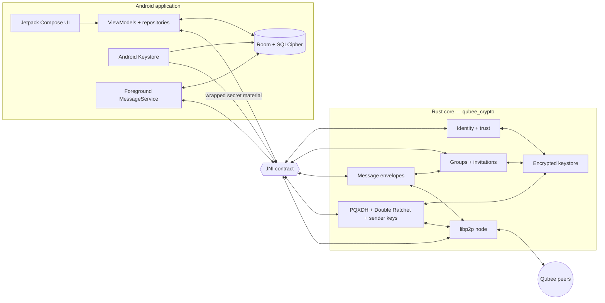
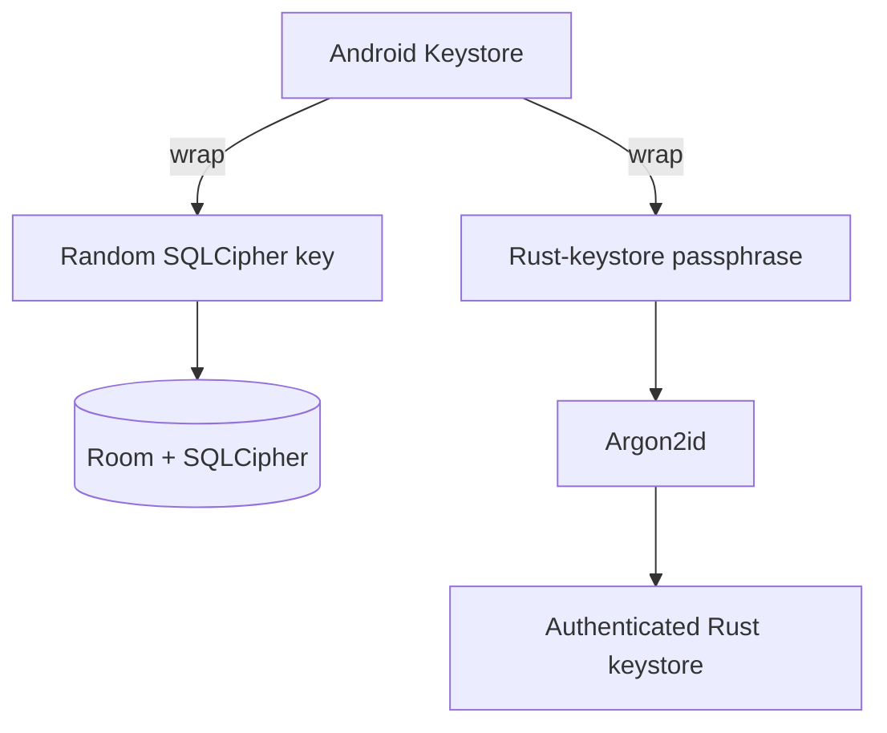

<p align="center">
  <a href="docs/branding/qubee_mark_master.svg">
    
  </a>
</p>

<h1 align="center">Qubee</h1>

<p align="center">
  <strong>Post-quantum · end-to-end encrypted · peer-to-peer messaging for Android</strong><br />
  Kotlin/Jetpack Compose on the outside. Rust cryptographic + networking core on the inside.
</p>

<p align="center">
  <a href="https://github.com/MKlolbullen/Qubee/actions/workflows/ci.yml"></a>
  <a href="https://github.com/MKlolbullen/Qubee/actions/workflows/android-smoke.yml"></a>
  <a href="https://github.com/MKlolbullen/Qubee/actions/workflows/instrumented-tests.yml"></a>
  <a href="https://github.com/MKlolbullen/Qubee/actions/workflows/jni-contracts.yml"></a>
  <a href="https://github.com/MKlolbullen/Qubee/releases"></a>
</p>

<p align="center">
  
  
  
  
  <a href="LICENSE.md"></a>
</p>

<p align="center">
  <a href="#what-qubee-is">Overview</a> ·
  <a href="#current-development-focus">Current focus</a> ·
  <a href="#architecture">Architecture</a> ·
  <a href="#security-model">Security</a> ·
  <a href="#build-from-source">Build</a> ·
  <a href="#testing">Testing</a> ·
  <a href="#roadmap">Roadmap</a>
</p>

---

> [!WARNING]
> **Qubee is pre-alpha research software.** It has not received an independent security audit. Do not use it for safety-of-life communications, high-risk operational traffic, or anything where compromise would be catastrophic. The Rust core is heavily tested, but the Android application and complete device-to-device lifecycle are still under active validation.

## What Qubee is

Qubee is an experimental Android messenger built around four principles:

1. **Cryptographic authority belongs in a memory-safe core.** Long-term identity, key management, protocol state, encryption, signatures, sender-key state and peer-to-peer networking live in Rust. Kotlin owns Android lifecycle, persistence orchestration and UI.
2. **Post-quantum security should be hybrid and explicit.** Qubee combines classical primitives with NIST-standardized post-quantum primitives rather than treating a single PQ algorithm as magic dust.
3. **No central message custodian.** Message transport is peer-to-peer over libp2p. Infrastructure may eventually assist discovery, rendezvous or relaying, but it must never become a plaintext message server or key authority.
4. **Implemented is not the same as validated.** Security-sensitive features stay gated until their real-device, persistence and failure-mode behavior is proven.

### Qubee is — and is not

| Qubee is | Qubee is not |
|---|---|
| A research-grade Android secure messenger with a Rust security core | A finished Signal replacement |
| Hybrid classical + post-quantum cryptography | “Quantum encryption” marketing fog |
| Direct P2P communication over libp2p | Anonymous networking by default |
| Explicit fingerprint / SAS / QR verification | Automatic proof that a human identity is trustworthy |
| Encrypted local persistence with Android Keystore integration | Protection from a fully compromised, unlocked device |
| A security-engineering project with adversarial tests and pinned wire formats | Independently audited production software |

## Current development focus

### `v0.2.0 — Ratchet Cutover`

The current priority is not adding another crypto primitive. It is validating the forward-secret path already in the tree and making it safe to become the default.

**Automated / host-verifiable work now includes:**

- PQXDH + Double Ratchet integration tests across the public JNI-facing API.
- 100-message alternating conversations to force repeated DH ratchet transitions.
- replay, tamper, cross-session and cross-group substitution rejection.
- sender-key removal rekey, late-join behavior and restart persistence.
- crash-consistency tests proving ratchet positions are not reused after restart.
- `PREPARED → SENDING → SENT/DELIVERED|FAILED` outbound persistence semantics.
- property-based parser robustness against arbitrary bytes, truncation, corruption and hostile length prefixes.
- full-byte golden vectors for deterministic signed protocol payloads.

**Still required before the ratchet send path should become the default:**

- physical-device validation across multiple Android/OEM combinations;
- Doze/background-kill and network-transition testing;
- release/R8 JNI callback validation;
- auth-bound datastore validation on real hardware;
- complete 1:1 delivery acknowledgement semantics;
- correct durable direct-message retry routing;
- metadata-parity hardening for the sender-key group wire format before it replaces the current group envelope.

See [`docs/manual-testing/ratchet-cutover-device-matrix.md`](docs/manual-testing/ratchet-cutover-device-matrix.md) and [`tests/ratchet_cutover_e2e.rs`](tests/ratchet_cutover_e2e.rs).

## At a glance

| Layer | Implementation |
|---|---|
| **Android client** | Kotlin, Jetpack Compose, Material 3, MVVM, Hilt, Coroutines/Flow |
| **Native core** | Rust crate `qubee_crypto`, exposed through JNI as Android `.so` libraries |
| **Identity signatures** | Hybrid Ed25519 + ML-DSA-44; both components must verify |
| **Post-quantum KEM** | ML-KEM-768 |
| **Classical agreement** | X25519 in the ratchet/prekey design |
| **Payload encryption** | ChaCha20-Poly1305 |
| **Hashing / derivation** | BLAKE3, HKDF, SHA-2, Argon2id |
| **P2P networking** | libp2p over TCP, WebSocket and QUIC; Noise/TLS, Yamux, anonymous gossipsub, Kademlia, DNS |
| **Android storage** | Room over SQLCipher; random DB key wrapped by Android Keystore |
| **Rust key storage** | Authenticated encrypted keystore, atomic writes, zeroization and secure-memory helpers |
| **Group model** | Maximum 16 members; Owner, Admin, Moderator, Member, Observer |
| **Supported Android** | `minSdk 24`, `targetSdk 34`, four ABIs |
| **License** | MIT |

## Feature status

The distinction between **active**, **dark-launched**, **foundation-only** and **planned** is deliberate.

| Capability | Status | Notes |
|---|---:|---|
| Hybrid identity + signed onboarding | ✅ Active | Ed25519 + ML-DSA-44 identity material is generated and persisted by Rust. |
| QR/deep-link identity sharing | ✅ Active | `qubee://identity/...` onboarding flow. |
| Fingerprint / SAS / QR verification | ✅ Active | Trust state persists and key changes can invalidate prior verification. |
| Direct libp2p networking | ✅ Active | TCP/WebSocket + Noise and QUIC; persistent `PeerId`. |
| Anonymous gossip authorship | ✅ Active | Group gossip no longer broadcasts the author `PeerId`; app-layer crypto remains the authenticity gate. |
| Blinded rotating group topics | ✅ Active | Topic names no longer contain a stable plaintext group identifier. |
| `QUBEE_GMS\x04` group envelope | ✅ Active | Current signed-envelope group path removes the plaintext group id using a per-message keyed selector. |
| SQLCipher-backed Android storage | ✅ Active | Messages, contacts and conversations are encrypted at rest. |
| App screen lock | ✅ Active | Optional biometric/device-credential gate with `FLAG_SECURE`. |
| Auth-bound datastore key | 🟡 Device-validation pending | Cold-process datastore access is intended to require user authentication when Screen Lock is enabled. |
| PQXDH + Double Ratchet | 🟡 Dark-launched | Send + receive paths are wired, fail closed and persist sessions; emission is still gated. |
| Group sender keys | 🟡 Dark-launched | Distribution, rekey and receive paths are wired; default emission remains gated. |
| Crash-consistent outbound FSM | 🟡 Cutover validation | `PREPARED` rows prevent silent loss around ratchet advancement; durable ciphertext is retried verbatim. |
| Delivery acknowledgements | 🟡 Partial | Group sender-key ACKs exist; 1:1 ratchet delivery semantics still need completion. |
| Tor / Nym transport posture | 🟡 Foundation only | `Direct`, `TorOnion`, `NymMixnet` config + fail-closed guards exist, but no anonymising transport is wired yet. |
| Reproducible signed releases | 🟡 Infrastructure present | Release workflow and verification guidance exist; verify actual tags/checksums/CI. |
| Multi-device identity sync | ❌ Not shipped | Identity remains device-local. |
| Voice/video calling | ❌ Not shipped | Feature-gated research code only. |
| File transfer | ❌ Not shipped | Legacy code is not production-ready. |

## Architecture

Qubee keeps raw long-term secret operations out of Kotlin. Android requests operations; the Rust core owns cryptographic state and bounded wire processing.



### Responsibility boundary

| Android owns | Rust owns |
|---|---|
| Screens, navigation, permissions, lifecycle | Identity key generation and verification |
| ViewModels, repositories, UI state | Hybrid signatures and canonical signed bytes |
| Room entities + SQLCipher integration | ML-KEM encapsulation/decapsulation |
| Foreground service and notifications | Group key rotation and membership state |
| QR scanner and share intents | Ratchet/session state and replay handling |
| Android Keystore key wrapping | Encrypted Rust keystore and secret handling |
| User-facing trust ceremonies | libp2p transport and authenticated peer events |

## Security model

### Identity

Qubee uses hybrid long-term identity signatures:

- **Ed25519** for mature classical authentication.
- **ML-DSA-44** for post-quantum signature resistance.
- Verification requires **both** components.
- Canonical signed bytes are domain-separated and versioned.

### Key establishment

- **ML-KEM-768** supplies post-quantum KEM protection.
- **X25519** participates in the ratchet/prekey design.
- The dark-launched direct-message path uses PQXDH-style establishment followed by a persistent Double Ratchet.

### Message encryption

- ChaCha20-Poly1305 protects message payloads and protocol envelopes.
- Forward-secret 1:1 sessions evolve message keys per ratchet state.
- Group sender keys evolve per sender and are redistributed after relevant membership changes.
- Failed ratchet operations do **not** silently downgrade to the legacy path.

### Network metadata

Tier-1 metadata reductions already landed:

- anonymous gossipsub authorship;
- mDNS disabled by default;
- rotating blinded topic identifiers;
- length-padding buckets on the forward-secret paths;
- active `QUBEE_GMS\x04` envelope removes the plaintext group identifier.

What this does **not** solve:

- direct peers still learn network addresses;
- timing/volume correlation remains possible;
- Tor and Nym modes are currently fail-closed foundations, not working transports.

See [`docs/architecture/network-privacy.md`](docs/architecture/network-privacy.md).

### Local storage



The Rust keystore uses authenticated encryption, slot-specific associated data, atomic file writes and explicit secret zeroization. Android Keystore protects the material needed to open the SQLCipher and Rust stores.

### Current security posture

| Property | Position |
|---|---|
| Network payload confidentiality | Yes |
| Hybrid long-term authentication | Yes |
| NIST PQ KEM/signature primitives | Yes — ML-KEM-768 + ML-DSA-44 |
| Local database encryption | Yes |
| Ratchet forward secrecy | Implemented, dark-launched pending device validation |
| Post-compromise security | Implemented in the ratchet design; not yet the default message path |
| Deniability | Ratcheted formats are designed for it; legacy signed envelopes are non-repudiable |
| Group-author `PeerId` exposure in gossip | Reduced — gossip authorship is anonymous |
| Stable plaintext group identifier on active `\x04` envelope | No |
| IP-address privacy | No on the shipped direct transport |
| Traffic-analysis resistance | Partial only |
| Protection after complete unlocked-device compromise | No |
| Independent security audit | No |

For vulnerability reporting and safe-harbour terms, read [`SECURITY.md`](SECURITY.md).

## Architectural invariants

Changes touching crypto, wire formats, membership or JNI should preserve these rules:

1. **Rust remains the cryptographic authority.**
2. **Both hybrid signature components must verify.**
3. **Canonical signed bytes are versioned and domain-separated.**
4. **Untrusted lengths are bounded before allocation.**
5. **State mutates only after authentication succeeds.**
6. **Removed members never receive rotated group material.**
7. **Trust is never silently inherited across an identity-key change.**
8. **JNI failures fail closed without aborting the Android process.**
9. **Secrets do not cross JNI as immutable Java strings.**
10. **Wire-format changes require pinned vectors and migration reasoning.**
11. **A failed privacy mode must never silently fall back to a less-private transport.**
12. **Retries reuse durable ciphertext; they do not re-encrypt and burn another ratchet position.**

## A look at the app

<p align="center">
  
  
  
  
</p>
<p align="center"><em>Design mockups. Committed Paparazzi baselines are the source of truth for rendered UI.</em></p>

### Branding

The canonical Qubee mark is the **Q + bee + key** symbol in [`docs/branding/qubee_mark_master.svg`](docs/branding/qubee_mark_master.svg). The high-fidelity README/marketing raster is [`docs/branding/logo.png`](docs/branding/logo.png). Android uses a simplified vector/adaptive-icon version for runtime assets.

See [`docs/branding/README.md`](docs/branding/README.md) for sizing and export guidance.

## Build from source

### Prerequisites

- Git
- JDK 17
- Android Studio / Android SDK 34
- Android NDK **r26b** (`26.1.10909125`)
- Rust **1.88** as pinned by `rust-toolchain.toml`
- `cargo-ndk` 3.x

### Clone

```bash
git clone https://github.com/MKlolbullen/Qubee.git
cd Qubee
```

### Rust + Android targets

```bash
rustup show
rustup target add \
  aarch64-linux-android \
  armv7-linux-androideabi \
  x86_64-linux-android \
  i686-linux-android

cargo install cargo-ndk --locked --version '^3'
```

### Android SDK / NDK

```bash
export ANDROID_HOME="$HOME/Android/Sdk"
export ANDROID_NDK_HOME="$ANDROID_HOME/ndk/26.1.10909125"
export NDK_HOME="$ANDROID_NDK_HOME"
printf 'sdk.dir=%s\n' "$ANDROID_HOME" > local.properties
```

### Build Rust shared libraries

Linux/macOS/WSL:

```bash
chmod +x build_rust.sh
./build_rust.sh
```

Windows PowerShell:

```powershell
./build_rust.ps1
```

### Build Android

```bash
chmod +x gradlew
./gradlew :app:assembleDebug --no-daemon --stacktrace
adb install -r app/build/outputs/apk/debug/app-debug.apk
```

Release/R8 dry run:

```bash
./gradlew :app:assembleRelease --no-daemon --stacktrace
```

Signing variables and release verification are documented in [`RELEASE.md`](RELEASE.md).

## Testing

### Rust core

```bash
cargo fmt --all -- --check
cargo clippy --all-targets -- -D warnings
cargo test --locked
cargo build --features _typecheck_jni
cargo bench --no-run
```

### Security audit

```bash
cargo install --locked cargo-audit --version 0.22.2
cargo audit --deny unsound --deny yanked
```

### JNI contracts

```bash
bash scripts/check_jni_contracts.sh
bash scripts/audit_message_file_bridge.sh
```

### Android JVM + screenshot tests

```bash
./gradlew :app:testDebugUnitTest
./gradlew :app:verifyPaparazziDebug
```

### Instrumented Android tests

```bash
./gradlew :app:connectedDebugAndroidTest --no-daemon --stacktrace
```

### Security-focused test map

| Area | Representative coverage |
|---|---|
| Hybrid signatures | both components required; malformed/future-dated input rejection |
| Ratchet | ping-pong, skipped keys, replay, tamper, persistence, crash no-reuse |
| Groups | joins, roles, ownership transfer, removal rekey, late joiners |
| Wire parsers | arbitrary input, truncation, corruption, hostile length claims |
| Wire stability | full-byte golden vectors + versioned canonical encodings |
| Keystore | AAD slot binding, atomic writes, migration, zeroization paths |
| Networking | in-process libp2p tests + anonymous gossip behavior |
| Android storage | Room / SQLCipher / Keystore integration |
| UI | Paparazzi snapshots + selected instrumented flows |

## CI/CD

| Workflow | Purpose |
|---|---|
| [`ci.yml`](.github/workflows/ci.yml) | Rust format, clippy, tests, JNI typecheck, benchmark compile, RustSec audit |
| [`jni-contracts.yml`](.github/workflows/jni-contracts.yml) | Kotlin ↔ Rust JNI symbol/descriptor parity |
| [`android-smoke.yml`](.github/workflows/android-smoke.yml) | Four-ABI Rust build, debug APK, release/R8 dry run, lint |
| [`instrumented-tests.yml`](.github/workflows/instrumented-tests.yml) | Emulator/device integration tests |
| [`release.yml`](.github/workflows/release.yml) | Signed tagged APK, verification and checksums |

## Project structure

```text
Qubee/
├── app/
│   └── src/main/java/com/qubee/messenger/
│       ├── crypto/          # Kotlin JNI facade
│       ├── data/            # Room entities, DAOs, repositories
│       ├── security/        # Android Keystore / SQLCipher integration
│       ├── service/         # P2P lifecycle + message handling
│       └── ui/              # Compose application surfaces
├── src/
│   ├── identity/            # hybrid identity keys
│   ├── onboarding/          # signed onboarding bundles
│   ├── groups/              # groups, roles, invites, handshakes
│   ├── ratchet/             # PQXDH, Double Ratchet, sender keys
│   ├── network/             # libp2p node
│   ├── storage/             # encrypted Rust keystore
│   ├── security/            # RNG / secure-memory helpers
│   └── jni_api.rs           # Android JNI boundary
├── tests/                   # integration, adversarial and wire tests
├── scripts/                 # JNI / bridge audits
├── docs/                    # architecture, branding, testing, threat-model docs
└── .github/workflows/       # CI + release automation
```

## Roadmap

### `v0.2.0 — Ratchet Cutover`

- [x] Host-level ratchet integration/adversarial matrix.
- [x] Outbound crash-consistency FSM + no-reuse tests.
- [x] Parser robustness sweep in normal CI.
- [x] Expanded full-byte wire golden vectors.
- [x] Physical-device validation runbook.
- [ ] Fix direct-message retry routing and pin it with regression tests.
- [ ] Complete 1:1 ratchet delivery acknowledgements.
- [ ] Give the sender-key group format the same metadata privacy as `QUBEE_GMS\x04`.
- [ ] Run the complete physical-device matrix on release builds across multiple OEMs.
- [ ] Enable the ratchet send path by default only after the matrix is green.

### `v0.3.x — Reliable P2P`

- [ ] Harden reconnect behavior across mobile network changes.
- [ ] Evaluate AutoNAT / DCUtR / Circuit Relay v2 / rendezvous or equivalent untrusted infrastructure.
- [ ] Improve offline recovery UX and delivery-state diagnostics.

### `v0.4.x — Transport privacy`

- [x] Fail-closed `Direct` / `TorOnion` / `NymMixnet` posture foundation.
- [ ] Implement and validate an anonymising transport.
- [ ] Keep mDNS/address-advertising behavior privacy-aware under non-direct profiles.
- [ ] Measure latency, battery and traffic-analysis tradeoffs on real devices.

### Later

- [ ] Multi-device identity/session synchronization.
- [ ] Secure backup/export with explicit recovery-key design.
- [ ] Rebuilt file transfer on current protocol foundations.
- [ ] Voice/video calling only after the messaging path is mature.
- [ ] Independent review of protocol composition, JNI/state transitions and Android lifecycle behavior.

## Contributing

Read [`CONTRIBUTING.md`](CONTRIBUTING.md) first.

Security-sensitive changes should:

- state the threat or invariant being addressed;
- add adversarial tests, not only happy-path tests;
- explain wire-format or persistent-state changes;
- run Rust, JNI and relevant Android checks;
- avoid silent fallbacks or optimistic security claims.

## Reporting security issues

**Do not open a public issue for a vulnerability.** Use the private vulnerability reporting flow described in [`SECURITY.md`](SECURITY.md).

Useful reports include the tested commit SHA, a minimal reproducer/failing test, affected layer, impact and realistic attacker prerequisites.

## License

Qubee is distributed under the [MIT License](LICENSE.md).

---

<p align="center">
  <strong>Research the protocol. Break the assumptions. Improve the implementation.</strong><br />
  Secure messaging deserves better than a lock icon and a confident paragraph.
</p>
