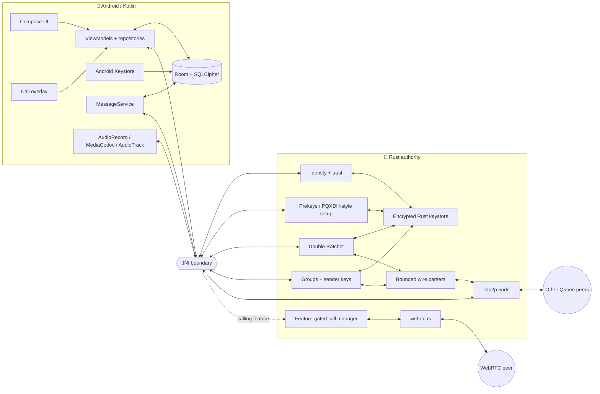
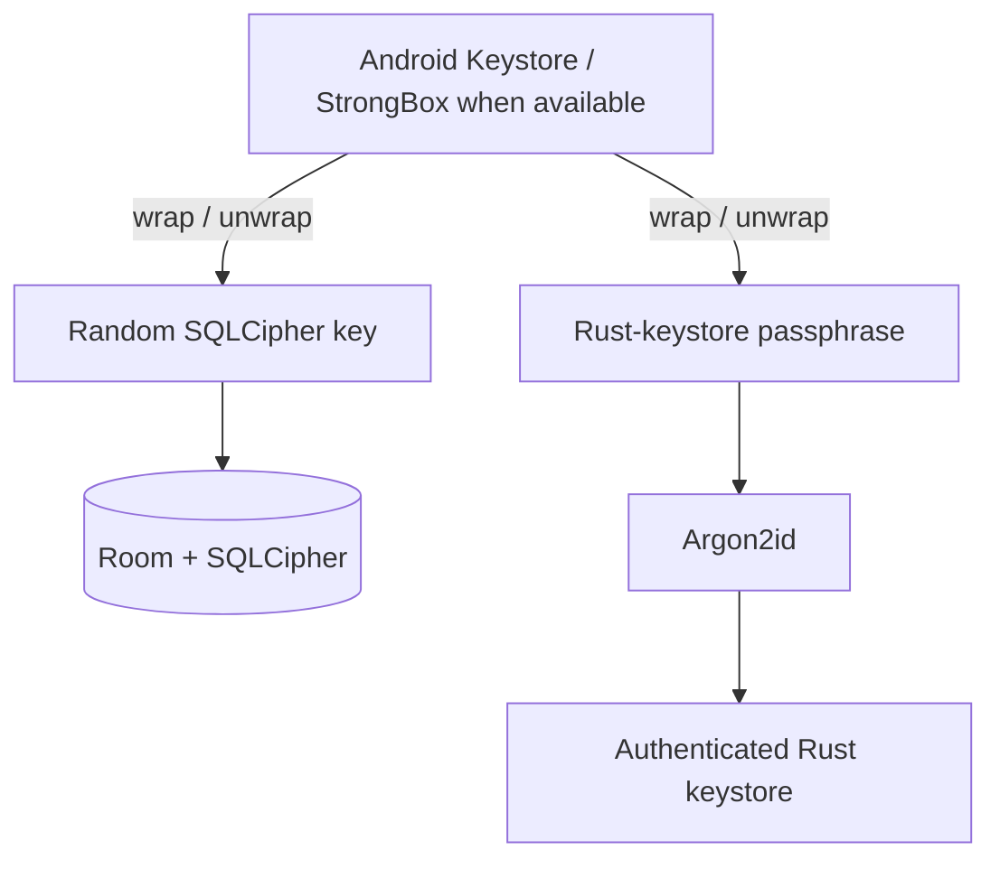
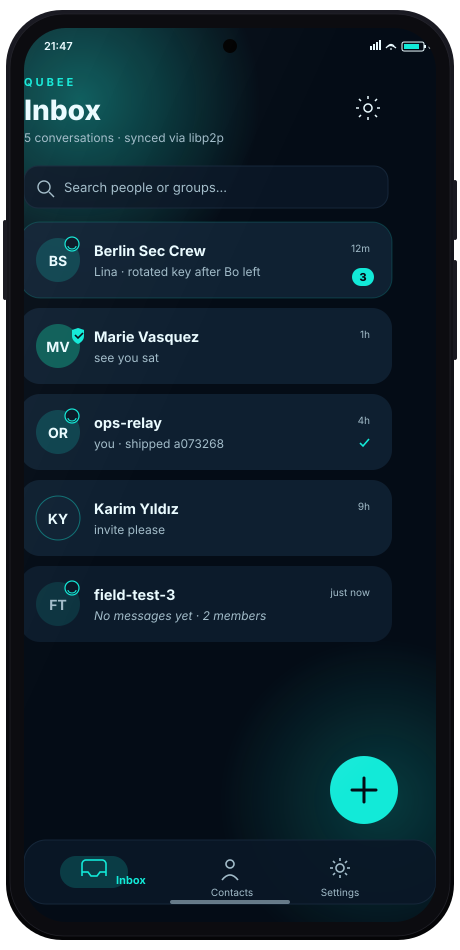
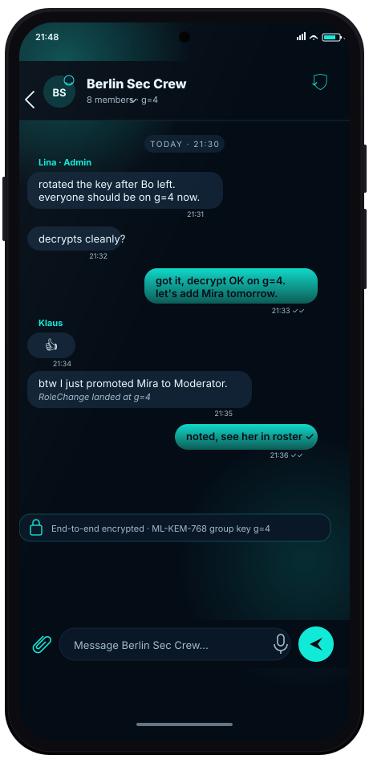
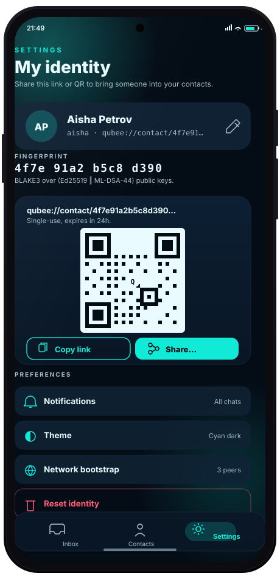

<p align="center">
  <a href="docs/branding/qubee_mark_master.svg">
    
  </a>
</p>

<h1 align="center">🐝 Qubee</h1>

<p align="center">
  <strong>Post-quantum · end-to-end encrypted · peer-to-peer messaging for Android</strong><br />
  Jetpack Compose on the outside. Rust cryptography + protocol state + libp2p on the inside.
</p>

<p align="center">
  <a href="https://github.com/MKlolbullen/Qubee/actions/workflows/ci.yml"></a>
  <a href="https://github.com/MKlolbullen/Qubee/actions/workflows/android-smoke.yml"></a>
  <a href="https://github.com/MKlolbullen/Qubee/actions/workflows/calling.yml"></a>
  <a href="https://github.com/MKlolbullen/Qubee/actions/workflows/jni-contracts.yml"></a>
  <a href="https://github.com/MKlolbullen/Qubee/releases"></a>
</p>

<p align="center">
  
  
  
  
  
  <a href="LICENSE.md"></a>
</p>

<p align="center">
  <a href="#-what-is-qubee">Overview</a> ·
  <a href="#-feature-status">Features</a> ·
  <a href="#-architecture">Architecture</a> ·
  <a href="#-security-model">Security</a> ·
  <a href="#-voice--video-calling">Calling</a> ·
  <a href="#-build-from-source">Build</a> ·
  <a href="#-roadmap">Roadmap</a>
</p>

---

> [!WARNING]
> **Qubee is pre-alpha research software and has not received an independent security audit.**
> It is not appropriate for safety-of-life communications, high-risk operational traffic, or any situation where compromise would be catastrophic. The Rust core has substantial automated coverage, but the complete Android/device/network lifecycle is still being validated.

## ⚡ What is Qubee?

Qubee is an experimental Android messenger designed around a deliberately narrow security boundary:

- **Kotlin orchestrates. Rust authorizes.** Android owns UI, lifecycle, permissions and database orchestration; raw private-key operations, ratchet state, sender-key state, wire parsing and network protocol state remain in Rust.
- **Post-quantum security is hybrid, not magical.** Qubee combines classical primitives with NIST-standardized ML-KEM and ML-DSA rather than treating a single PQ algorithm as a universal answer.
- **Messages are peer-to-peer.** libp2p provides the transport substrate. Qubee does not depend on a central plaintext message store or central key custodian.
- **Forward secrecy is the default path.** 1:1 messaging uses a PQXDH-style setup followed by a persistent Double Ratchet; groups use sender keys.
- **Metadata reduction is explicit but incomplete.** Qubee removes several avoidable identifiers from group traffic, but direct peers still learn network addresses and traffic analysis remains possible.
- **Claims track code, not aspirations.** Features that compile but are not shipped or device-validated are labeled that way here.

### Qubee is — and is not

| ✅ Qubee is | ❌ Qubee is not |
|---|---|
| A research-grade Android secure messenger | A finished Signal replacement |
| Hybrid classical + post-quantum cryptography | “Quantum encryption” marketing |
| A Rust security/protocol authority behind JNI | Kotlin reimplementations of private-key or ratchet logic |
| P2P messaging over libp2p | Anonymous networking by default |
| Explicit QR/SAS/fingerprint trust ceremonies | Automatic proof of a human identity |
| Encrypted local persistence | Protection from a fully compromised, unlocked device |
| Adversarial tests + pinned wire formats | Independently audited production software |

## 🧭 Current state

The main messaging stack is now substantially beyond a crypto proof-of-concept: onboarding, identities, direct messaging, sender-key groups, durable retry state, delivery acknowledgements, SQLCipher storage, Android Keystore integration and the libp2p node are connected through the app.

The current engineering focus should be **consolidation and failure-mode hardening**, not adding another primitive.

### `v0.2.x — Ratchet consolidation`

The outbound ratchet flag is currently **default-on in code**. Direct messages use the forward-secret `QUBEE_DMS` path and group emission uses sender keys. A kill-switch remains for the soak period.

Important reality check: the repository's physical-device runbook still calls for a recorded multi-OEM release-build matrix covering Doze, reboot, Wi-Fi/LTE changes, R8/JNI callbacks, auth-bound storage and identity-change behavior. Until those results are recorded, treat the default-on path as **implemented and heavily host-tested, but still undergoing complete device validation**.

The compatibility tail is also still present:

- legacy v2 message support has not been fully retired;
- sender-key v3 reception remains for older peers;
- current group emission is the keyed-selector v5 format, which removes the plaintext group id from the wire;
- the emergency legacy-emission switch should disappear after the compatibility window closes.

## 🧩 Feature status

Legend: **Active** = on the normal application path; **Gated** = integrated but excluded from the default release surface; **Foundation** = architectural seam only; **Not shipped** = do not depend on it.

| Capability | Status | Realistic description |
|---|---:|---|
| Hybrid identity | ✅ Active | Ed25519 + ML-DSA-44 identity material generated and persisted by Rust; both signature components must verify. |
| QR / deep-link identity sharing | ✅ Active | `qubee://identity/...` onboarding/share flow. |
| Fingerprint / SAS / QR verification | ✅ Active | Explicit trust ceremony with persisted trust state and key-change invalidation. |
| Direct P2P networking | ✅ Active | libp2p with TCP/WebSocket/QUIC, Noise/TLS, Yamux, Kademlia and request/response. |
| PQXDH-style 1:1 establishment | ✅ Active | ML-KEM/X25519 prekey material feeds the persistent direct-session design. |
| Double Ratchet direct messages | ✅ Active | Default outbound 1:1 path; replay/tamper checks and persistent ratchet state are implemented. |
| Deniable direct ACKs | ✅ Active | Delivery receipts are carried inside the ratchet rather than signed by the long-term identity key. |
| Group sender keys | ✅ Active | Per-sender chains, distribution, membership checks and rekey behavior are implemented. |
| Keyed-selector group envelope v5 | ✅ Active | Default group emission hides the plaintext group id from the application envelope. |
| Anonymous gossipsub authorship | ✅ Active | Group gossip does not advertise the author `PeerId`; cryptographic authentication is performed at the app layer. |
| Blinded rotating group topics | ✅ Active | Group topic names do not expose a stable plaintext group identifier. |
| Durable outbound FSM | ✅ Active / soaking | `PREPARED → SENDING → SENT/DELIVERED|FAILED` avoids re-encrypting a retry and protects ratchet state from silent reuse. |
| SQLCipher-backed Room storage | ✅ Active | Local conversations/messages use SQLCipher; key material is wrapped through Android Keystore. |
| Screen lock + auth-bound key path | ✅ Active / device-sensitive | Biometric/device-credential gate and auth-bound storage path exist; exact behavior remains OEM/API-sensitive. |
| Voice call signaling + UI | 🟡 Gated | Rust call manager, ratchet-carried signaling, JNI surface, Compose call overlay and call controls are wired. |
| Android voice media pipeline | 🟡 Gated / unvalidated | `AudioRecord → Opus → WebRTC` and remote `Opus → AudioTrack` exist, but physical-device codec/FGS/permission validation is still required. |
| Video capture/rendering | ❌ Not shipped | WebRTC video track seams exist; Android camera capture/render pipeline is not complete. |
| Tor transport | 🟠 Foundation | Fail-closed transport posture/config exists; no working Tor transport is shipped. |
| Nym mixnet transport | 🟠 Foundation | Experimental posture only; no working Nym transport is shipped. |
| Multi-device identity sync | ❌ Not shipped | Identity remains device-local. |
| File transfer | ❌ Not shipped | Legacy code is not production-ready and is excluded from the default surface. |

## 🏗 Architecture

The core invariant is simple:

> **Android may request an operation. Rust owns the secret state and decides whether the operation is valid.**



### Responsibility boundary

| Android / Kotlin owns | Rust owns |
|---|---|
| Compose screens and navigation | Identity private keys and signing |
| Permissions and Android lifecycle | ML-KEM encapsulation/decapsulation |
| Room entities and persistence orchestration | Direct ratchet state and replay handling |
| Foreground services and notifications | Group sender-key state and rotations |
| QR scanner and share intents | Canonical signed bytes and wire validation |
| Android Keystore wrapping | Encrypted Rust keystore |
| User-facing trust ceremony | libp2p protocol state |
| Audio capture/codec/playback scaffold | Call signaling/call-state/WebRTC orchestration when `calling` is enabled |

Raw identity private keys and ratchet secrets are not supposed to cross into Kotlin.

## 🔐 Security model

### Identity authentication

Qubee uses a hybrid long-term identity:

- **Ed25519** — mature classical signature component.
- **ML-DSA-44** — post-quantum signature component.
- **Both must verify.** A valid classical signature does not compensate for a failed PQ signature, or vice versa.
- Signed structures use canonical, versioned and domain-separated bytes.

### Key establishment and forward secrecy

The direct-message design combines:

- **ML-KEM-768** for post-quantum KEM protection;
- **X25519** for the classical component of the prekey/ratchet design;
- a persistent **Double Ratchet** for per-message key evolution and post-compromise recovery behavior.

The ratchet path is deliberately fail-closed: failure must not silently downgrade a message to a weaker legacy envelope.

### Payload protection

Qubee uses **ChaCha20-Poly1305** for authenticated encryption in the application crypto layer. Hash/KDF/storage support includes BLAKE3, HKDF, SHA-2 and Argon2id.

For groups, each sender advances an independent sender-key chain. Membership changes trigger the relevant redistribution/rekey behavior; removed members must not receive new group material.

### Delivery and retries

Retries are security-sensitive because encryption advances state.

Qubee's rule is:

> **A retry reuses the already-persisted ciphertext. It does not re-encrypt the plaintext and burn another ratchet step.**

The durable outbound state machine is designed around that invariant and around crash recovery between Room, Kotlin, JNI, Rust and the network.

## 🕵️ Metadata and privacy

Qubee reduces several avoidable metadata leaks:

- anonymous gossipsub authorship;
- mDNS disabled by default;
- blinded rotating group topics;
- padding buckets on forward-secret message paths;
- keyed-selector group envelopes that avoid sending a plaintext group id.

It does **not** currently provide strong network anonymity:

- direct peers can learn each other's IP addresses;
- STUN/TURN/ICE can expose network information during WebRTC negotiation;
- timing, volume and online-state correlation remain possible;
- Tor/Nym are not currently working transports.

See [`docs/architecture/network-privacy.md`](docs/architecture/network-privacy.md).

## 💾 Local storage



The Rust keystore uses authenticated encryption, per-install salt, Argon2id-based key derivation, atomic writes and explicit zeroization helpers. The JNI initialization path carries the keystore passphrase as a mutable byte array rather than a JVM `String` so both sides can wipe their copies.

The optional Screen Lock adds a UI gate and an auth-bound key path. This is stronger than a cosmetic lock screen, but live-process database handles and OEM/API differences remain part of the threat model.

## 🧱 Architectural invariants

Security-sensitive changes should preserve these rules:

1. **Rust remains the cryptographic authority.**
2. **Both hybrid signature components must verify.**
3. **Canonical signed bytes are versioned and domain-separated.**
4. **Untrusted lengths are bounded before allocation.**
5. **State mutates only after authentication succeeds.**
6. **Removed members never receive rotated group material.**
7. **Trust is never silently inherited across an identity-key change.**
8. **JNI errors fail closed without aborting the Android process.**
9. **Secrets do not cross JNI as immutable Java strings.**
10. **Wire-format changes require explicit versioning, vectors and compatibility policy.**
11. **Privacy-mode failure never silently falls back to a less-private transport.**
12. **Retries reuse durable ciphertext instead of advancing a ratchet twice.**

## 📞 Voice & video calling

Calling has moved from a dormant module to a real, but still gated, integration surface.

### What exists today

- a feature-gated Rust `CallManager`;
- WebRTC offer/answer and ICE handling through `webrtc-rs`;
- signaling transported through the authenticated/encrypted 1:1 message path;
- JNI methods for initiate/accept/end, mute/video toggles and media samples;
- Compose incoming/active call UI;
- a microphone foreground service;
- Android `AudioRecord` capture at 48 kHz PCM16;
- Android Opus encode/decode through `MediaCodec`;
- `AudioTrack` playback;
- remote-media callbacks back through JNI/Kotlin;
- dedicated `calling.yml` CI that compiles, lints and tests the feature.

### Keying model

For a 1:1 call, the caller currently generates a fresh random 32-byte media root and sends it inside the already authenticated + E2E-encrypted call invitation. Both endpoints then derive the same per-call media key using the call id and a canonical sorted pair of participant identities.

This is **not** a separate contributory DH exchange for the media root; secrecy of that root currently reduces to the security of the established 1:1 signaling session.

### What protects the actual media today?

WebRTC negotiates **DTLS-SRTP**. The Rust tree also contains a `MediaKey` / `MediaEncryption` abstraction, but the current Android encoded-sample pipeline does **not** apply an additional Qubee frame-encryption layer before handing Opus frames to WebRTC. The project should either keep DTLS-SRTP as the explicit media-security boundary or deliberately add and test an application-layer frame encryption scheme; documentation should not imply both are active when they are not.

### Why calling is still marked gated

The default Android native build runs Cargo **without** `--features calling`, so the normal release `.so` does not expose the calling JNI symbols. The Kotlin layer fails closed when those symbols are unavailable.

Before calling should be considered shippable, it needs at least:

- physical two-phone validation;
- API 34+ microphone foreground-service validation;
- runtime permission validation;
- codec compatibility across OEMs;
- bounded media queues/backpressure across every hop;
- mono/stereo capability normalization;
- echo cancellation / noise suppression / gain behavior;
- Wi-Fi ↔ cellular transitions and reconnect behavior;
- long-call memory/thermal/battery testing;
- explicit ICE/STUN/TURN metadata documentation;
- video capture/rendering only after the voice path is stable.

## 📱 UI previews

The repository includes lightweight SVG product mockups used to communicate the intended UI direction. They are design references, not proof that every screen is currently wired exactly as pictured.

<table>
  <tr>
    <td align="center"><br/><strong>Inbox</strong></td>
    <td align="center"><br/><strong>Group chat</strong></td>
    <td align="center"><br/><strong>Identity</strong></td>
  </tr>
</table>

More design references live in [`docs/mockups/`](docs/mockups/).

## 🧪 Testing & assurance

Qubee's useful security tests are mostly about **state transitions and glue**, not proving the underlying standard primitives again.

Current coverage includes areas such as:

- repeated Double Ratchet transitions;
- replay and tamper rejection;
- cross-session / cross-group substitution attempts;
- sender-key join/remove/rekey behavior;
- restart persistence;
- crash-consistent outbound recovery;
- malformed/truncated/oversized parser inputs;
- golden wire-format vectors;
- JNI contract parity;
- Android compile/smoke tests;
- Paparazzi screenshot tests;
- RustSec + OSV dependency scanning;
- feature-gated calling tests.

Useful local commands:

```bash
# Rust formatting, linting and default tests
cargo fmt --all -- --check
cargo clippy --all-targets -- -D warnings
cargo test --all-targets

# JNI surface on the host
cargo build --features _typecheck_jni

# Calling feature
cargo clippy --features calling --all-targets -- -D warnings
cargo test --features calling
cargo clippy --features "_typecheck_jni,calling" -- -D warnings

# Contract checks
bash scripts/check_jni_contracts.sh

# Android unit/compile smoke
./gradlew :app:compileDebugKotlin :app:testDebugUnitTest
```

See also:

- [`docs/two-device-walkthrough.md`](docs/two-device-walkthrough.md)
- [`docs/manual-testing/ratchet-cutover-device-matrix.md`](docs/manual-testing/ratchet-cutover-device-matrix.md)
- [`docs/screenshot-tests.md`](docs/screenshot-tests.md)
- [`docs/perf/baseline.md`](docs/perf/baseline.md)
- [`docs/reproducible-builds.md`](docs/reproducible-builds.md)

## 🛠 Build from source

### Prerequisites

- JDK 17
- Android SDK with API 34
- Android NDK **r26b / 26.1.10909125**
- Rust **1.88.0** from `rust-toolchain.toml`
- `cargo-ndk` 3.x

### Build the Rust JNI libraries

```bash
cargo install cargo-ndk --locked
./build_rust.sh
```

The script builds the four Android ABIs expected by the app:

- `arm64-v8a`
- `armeabi-v7a`
- `x86_64`
- `x86`

Generated `.so` files under `app/src/main/jniLibs/` are build artifacts and should **not** be committed to Git.

### Build the Android app

```bash
./gradlew :app:assembleDebug
```

For a release-like local validation:

```bash
./gradlew :app:assembleRelease
```

Release signing is environment/CI-driven; private keystores do not belong in the repository.

### Calling build note

The calling feature is intentionally not part of the default Rust library build. To compile the Rust calling surface on the host:

```bash
cargo test --features calling
cargo clippy --features "_typecheck_jni,calling" -- -D warnings
```

Do not interpret a green host calling build as physical-device validation of Android audio.

## 🔁 CI / release pipeline

| Workflow | Purpose |
|---|---|
| `ci.yml` | Rust fmt, clippy, tests, JNI host typecheck, bench compile, RustSec and OSV coverage |
| `android-smoke.yml` | Android build/smoke coverage |
| `jni-contracts.yml` | Kotlin ↔ Rust JNI contract checks |
| `instrumented-tests.yml` | Android instrumented-test surface |
| `calling.yml` | Feature-gated WebRTC/calling build, clippy, tests and JNI parity |
| `release.yml` | Android/Rust release assembly, signing, verification and checksums |

The release workflow builds native libraries during CI. Checked-in `.so` files are therefore unnecessary source artifacts and create repository bloat/history churn.

## 🗂 Repository layout

```text
Qubee/
├── app/                     # Android application
│   └── src/main/java/...    # Compose, repositories, services, JNI wrapper
├── src/                     # Rust security + protocol + networking core
│   ├── identity/
│   ├── ratchet/
│   ├── groups/
│   ├── network/
│   ├── storage/
│   └── calling/             # feature-gated WebRTC/call stack
├── tests/                   # integration / wire / adversarial tests
├── fuzz/                    # fuzz targets and corpora plumbing
├── scripts/                 # JNI and dependency/security checks
├── docs/                    # architecture, threat model, testing and UI docs
├── .github/workflows/       # CI + release automation
├── Cargo.toml
└── README.md
```

### Repository hygiene

- `Cargo.lock` stays committed.
- generated JNI `.so` files stay ignored;
- IDE-local `.idea/` state stays ignored;
- signing keys, local databases, `.env` files and runtime logs stay ignored;
- Room schema JSON snapshots are **not** ignored: once generated they should become reviewable migration artifacts.

If generated native libraries existed in older commits, removing them from the current tree does **not** shrink existing Git history. A coordinated `git filter-repo` history rewrite is a separate maintenance operation and changes commit SHAs.

## 🗺 Roadmap

The roadmap is intentionally ordered around **risk reduction before feature count**.

### 1. 🧹 Protocol + repository consolidation

- retire legacy v2 emission after the compatibility window;
- retire sender-key v3 reception when old peers no longer need it;
- remove the ratchet kill-switch once rollback is no longer required;
- commit Room schema snapshots and restore migration regression tests;
- remove generated JNI binaries and IDE state from the tracked tree;
- decide whether to rewrite history to remove historical binary bloat.

### 2. 🧯 State-machine hardening

- model direct-send crash transitions formally (TLA+/PlusCal is a good fit);
- explicitly test duplicate, delayed and concurrent frames;
- prove `RetryNeverAdvancesRatchetTwice`;
- prove `RemovedMemberNeverGetsNewGroupKey`;
- prove `KeyChangeNeverPreservesVerifiedTrust`;
- split the very large JNI module into smaller capability-focused modules while retaining one error/panic boundary.

### 3. 🌐 Reliable mobile P2P

- improve reachability behind NAT/mobile networks;
- evaluate AutoNAT / DCUtR / Circuit Relay v2 / rendezvous where they fit the threat model;
- harden reconnect and offline retry behavior around interface changes;
- test long-running background-service behavior across aggressive OEMs.

### 4. 📞 Calling hardening

- bound every media queue and define a drop/backpressure policy;
- normalize Opus capabilities to the Android capture format;
- validate real-device voice calls before video work;
- make the calling capability explicit in Android build/runtime UX;
- document the chosen media-encryption boundary precisely;
- add replay/stale-invite/call-id-substitution/concurrent-call tests;
- test ICE/TURN privacy and long-call rekey/reconnect behavior.

### 5. 🕶 Metadata resistance

- keep direct mode explicit;
- integrate Tor only when failure can remain fail-closed;
- evaluate Nym/mixnet transport as a separate privacy mode rather than silently degrading to direct IP;
- continue minimizing stable identifiers and distinguishability on the wire.

### 6. 🧾 Release assurance

- add `cargo-deny` policy for advisories/licenses/sources/bans;
- automate dependency updates in controlled batches;
- pin third-party GitHub Actions to immutable commit SHAs;
- generate SPDX/CycloneDX SBOMs;
- add build provenance/attestations;
- add CODEOWNERS / security-review boundaries for crypto, JNI and release workflows;
- seek independent protocol/application review before calling Qubee production-ready.

## 🤝 Contributing

Start with [`CONTRIBUTING.md`](CONTRIBUTING.md).

For security-sensitive changes, small PRs are preferable to giant refactors. A useful PR explains:

1. which invariant changes or remains unchanged;
2. which wire/state transition is affected;
3. how malformed/replayed/delayed inputs behave;
4. what persistence/restart behavior is expected;
5. which tests prove the claim.

## 🛡 Reporting security issues

**Do not report vulnerabilities in a public issue.** Read [`SECURITY.md`](SECURITY.md) for private reporting channels, scope and safe-harbour terms.

The highest-value review areas are usually the boundaries between otherwise-correct components: wire parsing, JNI, persistence, ratchet state, group membership, libp2p routing, call signaling and Android lifecycle.

## 📄 License

Qubee is licensed under the [MIT License](LICENSE.md).

---

<p align="center">
  <strong>🐝 Qubee — build the boring invariants first, then make the network weird.</strong>
</p>
