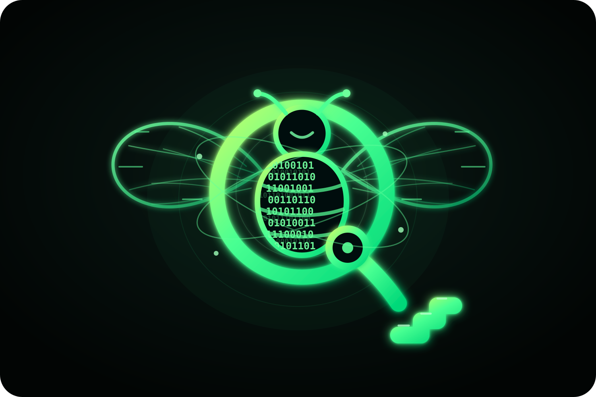

<p align="center">
  
</p>

# Qubee

Experimental end-to-end encrypted, peer-to-peer messaging for Android.
Jetpack Compose provides the app; Rust owns cryptography, protocol state and
libp2p networking. Minimum Android API **32** (Android 12L); compile/target API 34.

**Pre-alpha. No independent security audit.** Host-tested protocol code is not
proof of a secure mobile deployment. Device lifecycle, migrations, network
privacy and interoperability still need recorded acceptance tests.

## What works today

| Capability | Status and limits |
|---|---|
| Identity | Rust-managed Ed25519 + ML-DSA-44. Both signature components must verify; the identity ID binds both public keys. |
| Contact verification | QR, SAS and fingerprint comparison with persisted trust state. A valid signature alone does not identify a person. |
| Direct messages | Default PQXDH-style ML-KEM-768/X25519 establishment followed by a persistent Double Ratchet. |
| Groups | Sender-key chains; keyed-selector v5 emission hides the plaintext group ID. Group recovery still depends on rekeying and authorized distribution. |
| Delivery | Encrypted direct acknowledgements and durable retries of the exact stored ciphertext. |
| Files | Encrypted direct/group messages carry attachments up to **256 KiB**; attachment copies use Android Keystore-backed encryption. Device and multi-peer validation remains. |
| Local storage | SQLCipher-backed Room plus a Rust keystore with encrypted index, per-entry AEAD and recoverable master-key rotation. |
| Voice messages | Planned. Stored recordings are separate from live calls and need recording, codec, encrypted-storage and playback lifecycle work. |
| Voice/video calls | Build-gated research integration. Runtime fails closed until TURN provisioning and a private signaling carrier are available. |
| Tor/Nym and multi-device sync | Not shipped. |

## Security boundary

Android owns UI, permissions, services and storage orchestration. Rust owns
private-key operations, signed bytes, prekeys, ratchets, sender keys and wire
validation. Raw identity private keys and ratchet secrets should not cross JNI.

Direct setup combines ML-KEM-768 with X25519 through the existing HKDF design.
Contact and prekey authentication combines Ed25519 with ML-DSA-44. Payloads use
ChaCha20-Poly1305. Malformed keys, inconsistent identity IDs, failed hybrid
signatures and protocol failures must fail closed; they must not silently select
a legacy send format.

The initial PQ exchange targets **harvest-now/decrypt-later resistance**.
Subsequent DH ratchet recovery is classical. Qubee does not implement recurring
PQ KEM ratcheting or claim quantum post-compromise security. Group sender keys
and classical ephemeral signing keys are not an MLS deployment or a PQ group
security proof. Using standardized primitives does not make the protocol or
implementation independently audited or FIPS validated.

Application randomness is taken directly from the OS. The native pqcrypto
entropy path is separate and can abort on RNG failure. Zeroization guards reduce
avoidable secret copies; upstream PQ types and native stack buffers still limit
complete erasure. See the [crypto-boundary review](docs/security/crypto-boundary-hardening.md)
for exact versions, changes, threat assumptions and remaining work.

## Persistence and recovery

The Rust keystore encrypts both values and the index: contact/group identifiers,
tags, algorithms and timestamps are inside an authenticated `QKS1` snapshot.
Each entry additionally binds its ID and type as AEAD associated data. The
master key is wrapped using a caller-supplied secret, a per-install salt and
Argon2id; Android supplies a Keystore-wrapped high-entropy secret.

Direct-message operations commit session advancement, OTP consumption and
replay tracking together. Failed operations roll back before commit; uncertain
writes require reopening the keystore. Dropping a handle never writes. Master
rotation retains crash recovery across the separate master and database files.

**Upgrade compatibility:** old plaintext-index stores migrate on open. Older
binaries cannot read the new encrypted snapshot. Test migration before release;
reverting the app does not undo storage migration. Never silently create a new
identity after a storage authentication error.

These transactions cover the Rust store. Room, Kotlin callbacks and network
transmission are separate boundaries. Retrying a message must reuse its durable
ciphertext; restoring old protocol snapshots can reuse keys. Backups are disabled
on Android, and manual copying of live state is unsafe. A fully compromised,
unlocked endpoint can read current plaintext and keys.

The prekey implementation still has a single OTP rather than an ID-addressed
pool. Concurrent initiators can encounter a consumed OTP before republishing.
Prekey pooling, medium-term key rotation and cross-store crash recovery remain
priorities; do not assume unlimited asynchronous establishment works today.

## Metadata and files

Qubee uses opaque direct selectors, anonymous gossipsub authorship, rotating
blinded group topics, keyed group selectors and message padding. mDNS is disabled
by default. These reduce specific leaks; direct peers can still see IP addresses,
and observers can correlate timing, online state and traffic volume. Known
contacts can test some selectors. File sizes remain visible as ciphertext size
buckets, and local file paths, total sizes and filesystem activity remain visible.

Attachment filenames and bytes travel inside encrypted messages. Base64 framing
adds roughly one third to raw size; larger files and chunked transfer are future
work. Opening a file grants plaintext to the chosen external viewer. Temporary
exports use opaque random names, expire after ten minutes while Qubee runs and
are purged at next startup. Process death can leave an export until restart;
the viewer can retain its own copy. This is a documented plaintext export boundary.

See [network privacy](docs/architecture/network-privacy.md).

## Calling

The gated Android pipeline connects AudioRecord, Opus, WebRTC and AudioTrack;
video includes Camera2/VP8 capture and rendering. Signaling is bound to the
existing authenticated direct session. A fresh call media root is carried in
that encrypted session; it is not an independent contributory key exchange.
WebRTC **DTLS-SRTP** protects live media. The extra Qubee frame-encryption
abstraction is not applied to the current Android media pipeline.

Both build opt-ins are needed:

```bash
QUBEE_CALLING=1 ./build_rust.sh
./gradlew :app:assembleDebug -PqubeeCalling=true
```

These compile the research surface. They do not remove the runtime privacy gate.
STUN/TURN/ICE, private signaling, codecs, permissions, battery use, reconnects
and two-phone behavior require validation. Read the
[calling threat model](docs/architecture/calling-threat-model.md) and
[self-hosted calling deployment](deploy/calling/README.md).

## Build and test

Required: JDK 17, Android SDK API 34, NDK **26.1.10909125** (r26b),
Rust **1.88.0** from `rust-toolchain.toml`, and `cargo-ndk` 3.x.

```bash
cargo install cargo-ndk --locked --version '^3'
./build_rust.sh
./gradlew :app:assembleDebug
```

The script produces four Android ABIs: arm64-v8a, armeabi-v7a, x86_64 and x86.
Generated `.so` files are build artifacts and must not be committed.
See [reproducible builds](docs/reproducible-builds.md) for pinned inputs and
release verification.

```bash
cargo fmt --all -- --check
cargo clippy --locked --all-targets -- -D warnings
cargo test --locked --all-targets
cargo check --locked --features _typecheck_jni
cargo clippy --locked --features calling --all-targets -- -D warnings
cargo test --locked --features calling
bash scripts/check_jni_contracts.sh
./gradlew :app:compileDebugKotlin :app:testDebugUnitTest
./gradlew :app:connectedDebugAndroidTest
```

CI covers Rust, JNI contracts, Android builds, dependency advisories and emulator
tests. Host tests exercise malformed input, replay/substitution, ratchet recovery,
key persistence, failed commits and wire stability. Physical-device validation
is required on API 32 and 34 across OEMs: lock/unlock, process death, low storage,
upgrade/migration, reboot, Doze, network changes, attachments and peer interop.

Useful runbooks:

- [Two-device walkthrough](docs/two-device-walkthrough.md)
- [Ratchet cutover device matrix](docs/manual-testing/ratchet-cutover-device-matrix.md)
- [Double Ratchet design](docs/double-ratchet-design.md)
- [Security boundary review and follow-ups](docs/security/crypto-boundary-hardening.md)

## Next priorities

1. Resolve the existing DNS dependency advisory gate; select maintained PQ
   implementations and finish native entropy/secret-lifetime and ABI review.
2. Retire legacy emission/receive paths after interop testing; strengthen key
   publication epochs, expiry and authenticated identity changes.
3. Add ID-addressed prekey pooling and rotation; test cross-store crash recovery
   and snapshot rollback handling before extending ratcheting.
4. Reduce remaining metadata and replace plaintext viewer caches with streaming
   decryption. Build stored voice messages on the authenticated attachment path
   with bounded recording and encrypted temporary storage.

Contributions should include concrete state-transition tests and update claims
when behavior changes. Report security issues through the private channel described in
[SECURITY.md](SECURITY.md). License: [MIT](LICENSE.md).
