# Qubee cryptography flow

Qubee is designed as a post-quantum safe end-to-end messenger where Android/Kotlin owns application orchestration and presentation, while the Rust core owns cryptographic authority.

The rule is simple:

> Kotlin may request cryptographic operations. Rust performs them.

Kotlin must never implement fallback cryptography, plaintext compatibility envelopes, or silently downgrade security when a JNI symbol is missing.

## Layer model

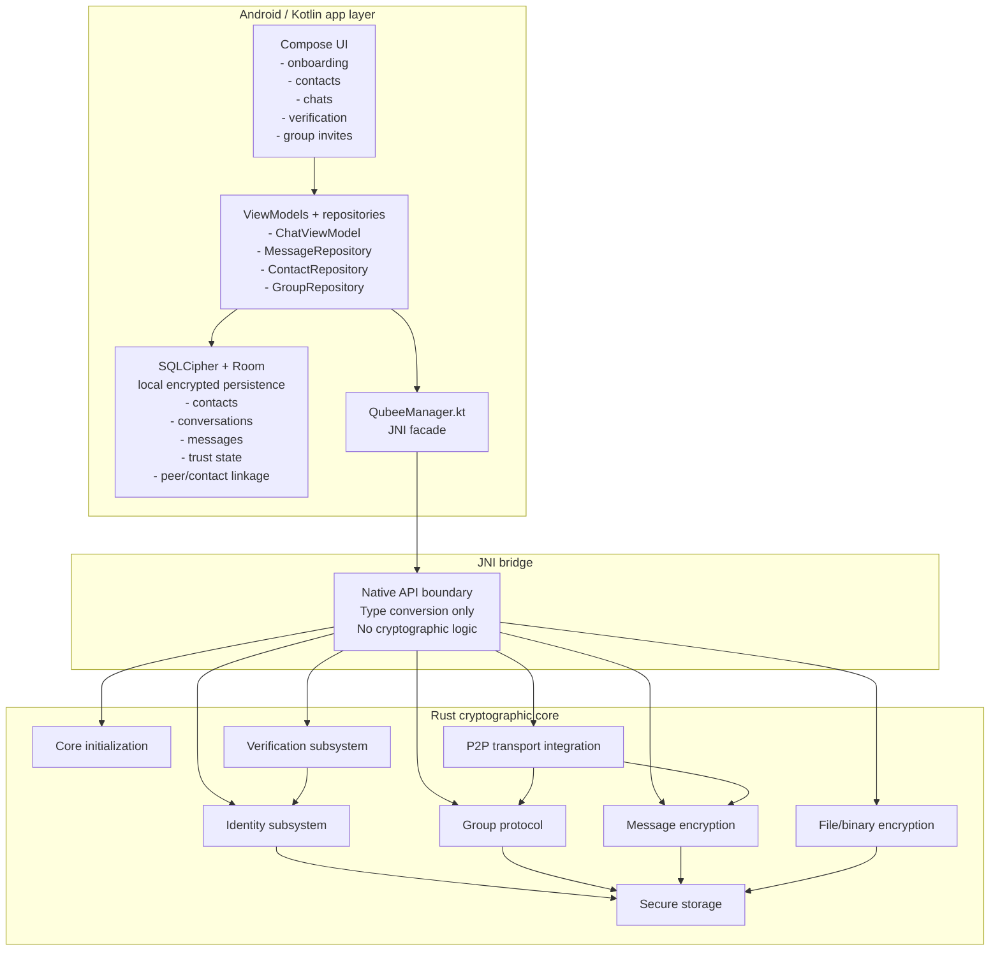

## Responsibilities

### Android / Kotlin

Kotlin owns:

- UI and user flows.
- ViewModels and application state.
- Room-backed persistence for metadata, contacts, conversations, messages, and trust state.
- Calling `QubeeManager.kt` for cryptographic operations.
- Passing opaque encrypted bytes to transport.

Kotlin must not own:

- private identity keys.
- session secrets.
- group keys.
- post-quantum KEM private keys.
- message/file encryption logic.
- fallback crypto behavior.

### JNI

JNI owns:

- converting Kotlin types to Rust-compatible values.
- returning Rust results to Kotlin.
- surfacing failures explicitly.

JNI must not own:

- cryptographic policy.
- envelope parsing semantics.
- plaintext compatibility paths.

### Rust core

Rust owns:

- identity key generation.
- fingerprint generation.
- SAS generation.
- invite parsing and validation.
- group handshake verification.
- group key handling.
- message encryption/decryption.
- file/binary encryption/decryption.
- replay/timestamp checks.
- secure storage of cryptographic material.

## Identity creation flow

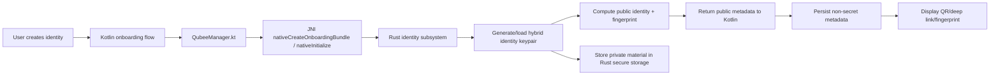

Security invariant:

> Private identity material must remain inside Rust-controlled storage.

## Contact onboarding flow

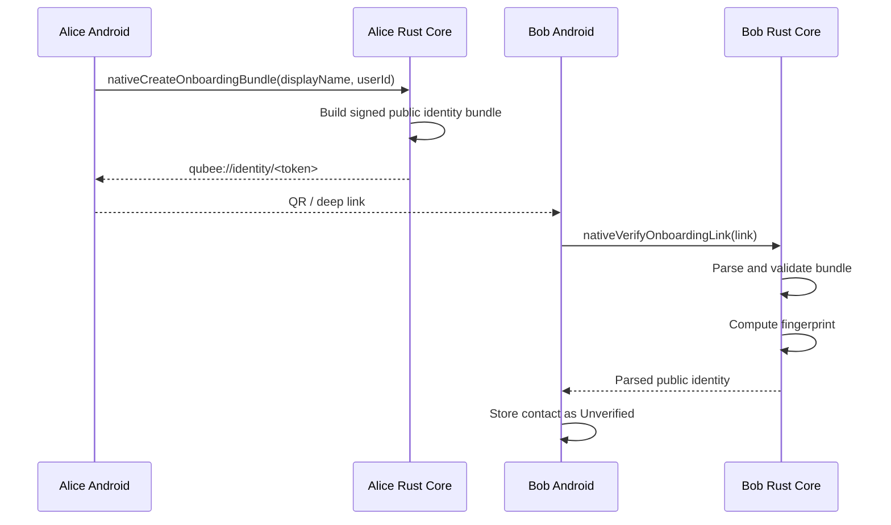

Imported contacts are not automatically verified. Import only proves the app parsed a public identity payload; it does not prove the user has authenticated that identity out-of-band.

## Fingerprint verification flow

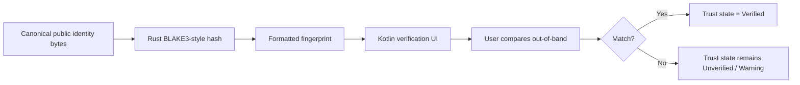

Security invariant:

> Verified trust must only be granted after a user-visible verification ceremony.

## SAS verification flow

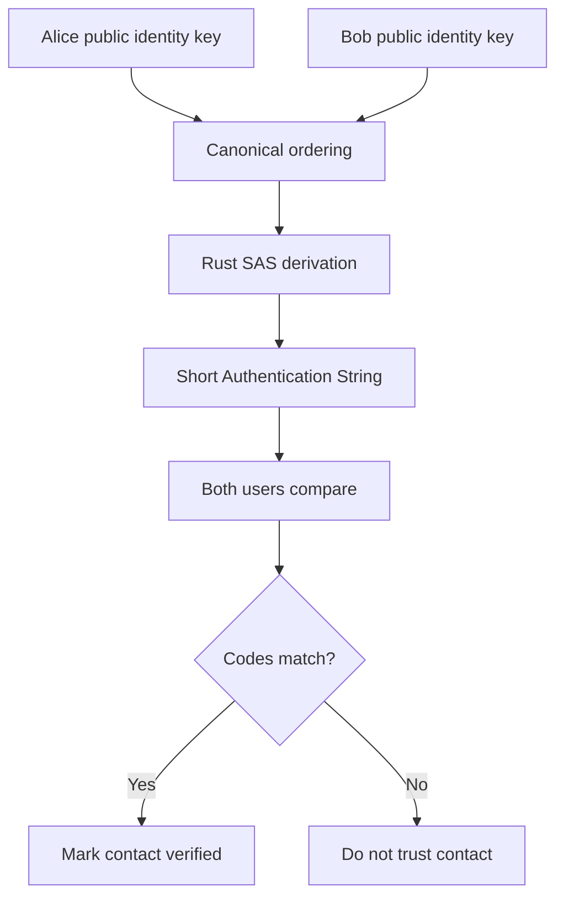

The SAS must be derived inside Rust from canonical public identity material. Kotlin displays the result; it does not derive it.

## Direct message send flow

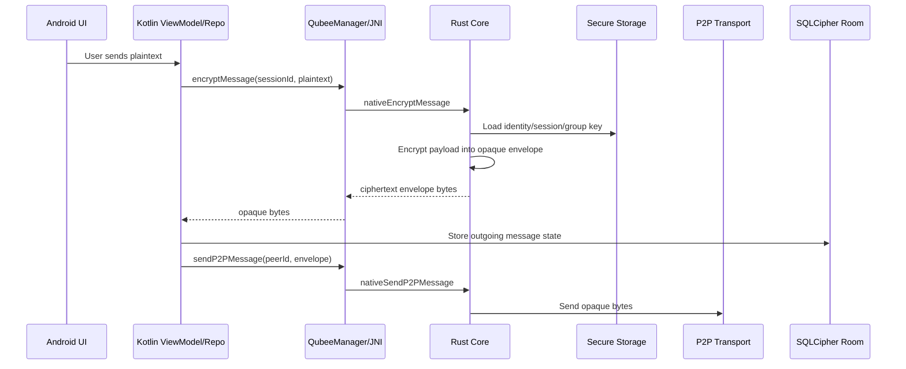

Message state should not become `Sent` merely because the user tapped send. The correct state transition is:

```text
Draft -> Encrypting -> EncryptedQueued -> Sending -> SentToTransport -> DeliveredToPeer -> Read
```

Failures should be explicit:

```text
FailedEncryption
FailedTransport
FailedDecryption
RejectedUntrustedSender
RejectedReplay
```

## Direct message receive flow

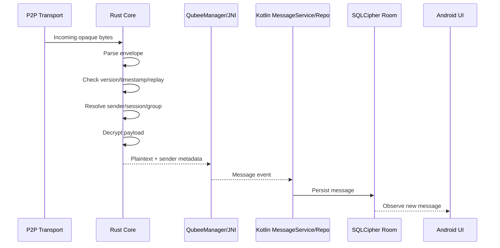

Security invariant:

> Rust parses and validates encrypted envelopes. Kotlin must not interpret cryptographic envelope internals.

## File/binary payload flow

For P1/P2, files/images/audio can be treated as binary payloads encrypted through the same Rust-owned envelope discipline used for messages.

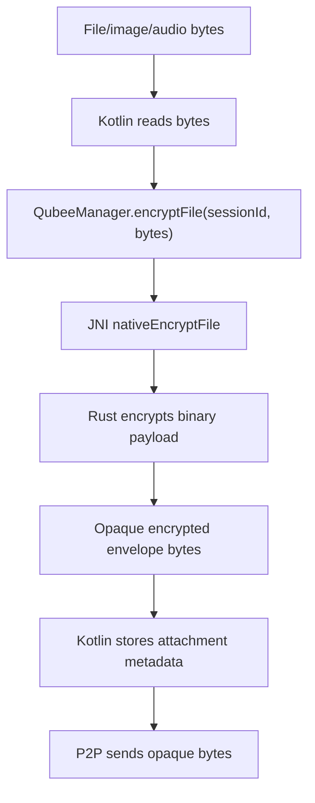

Receive path:

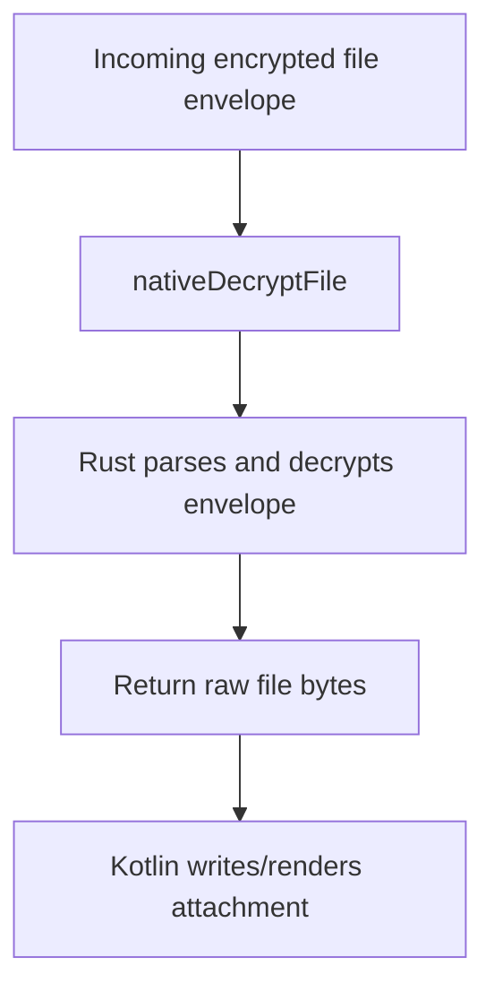

Future dedicated file protocol should add:

- chunked encryption.
- per-file manifest.
- per-chunk nonce/authentication.
- resumable transfer.
- content hash.
- encrypted thumbnails.

## Group protocol flow

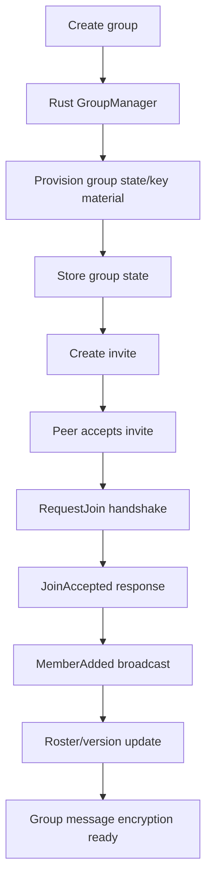

The group protocol is also useful as the current direct-message bridge substrate where one-to-one conversations map onto private session/group IDs.

## Group state sync flow

P2P broadcast is not durable. Members who are offline can miss membership updates. The group state sync flow lets a lagging member recover roster state.

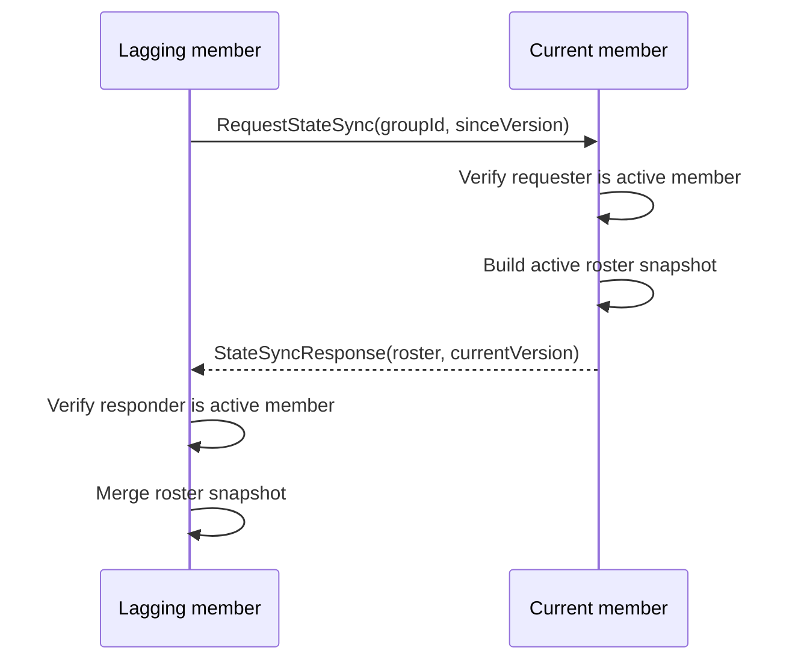

State sync does not automatically recover every missed group-key generation. A member may recover roster state but still fail decryption until key re-send/re-encapsulation exists. That failure is safer than guessing or silently weakening cryptography.

## Trust-state lifecycle

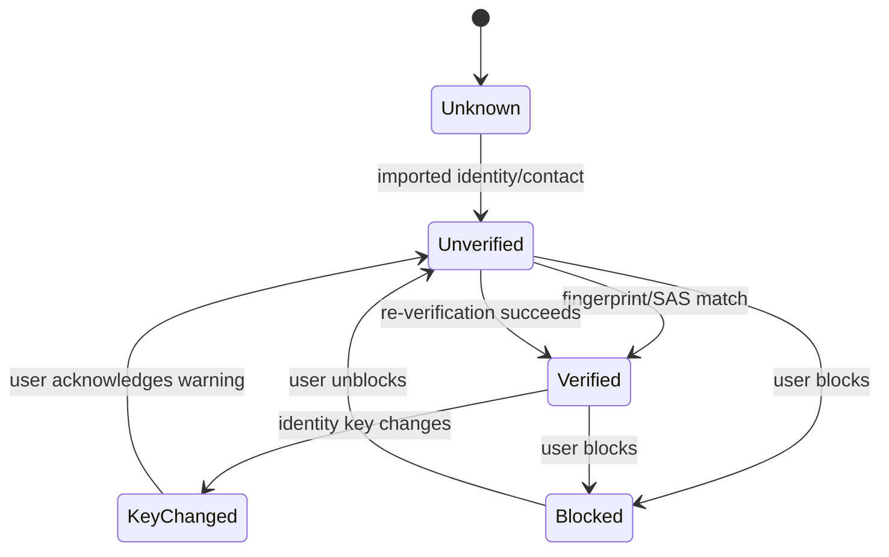

Hard invariant:

> Verified + changed identity key = KeyChanged, never Verified.

## Required diagnostics

Every build should be able to answer:

- Is Rust core initialized?
- What is the local identity fingerprint?
- Is the P2P node running?
- Which contacts are linked to which peer IDs?
- Which conversations have active session/group IDs?
- Did the last outbound message reach encrypted-envelope state?
- Did the last inbound message fail due to unknown sender, stale timestamp, replay, bad envelope, missing key, or trust-state rejection?

## Required test gates

The project should not be treated as cryptographically stable unless these pass:

```bash
bash scripts/check_jni_contracts.sh
bash scripts/audit_message_file_bridge.sh
cargo fmt --all --check
cargo clippy --all-targets --all-features -- -D warnings
cargo build --features _typecheck_jni
cargo test
./gradlew :app:assembleDebug
```

And the manual two-device plan must pass:

```text
A -> B encrypted text
B -> A encrypted text
fingerprint/SAS verification
verified state persists after restart
identity reset downgrades trust
unknown sender / key-change is not silently trusted
```
